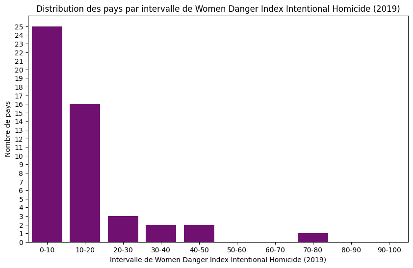
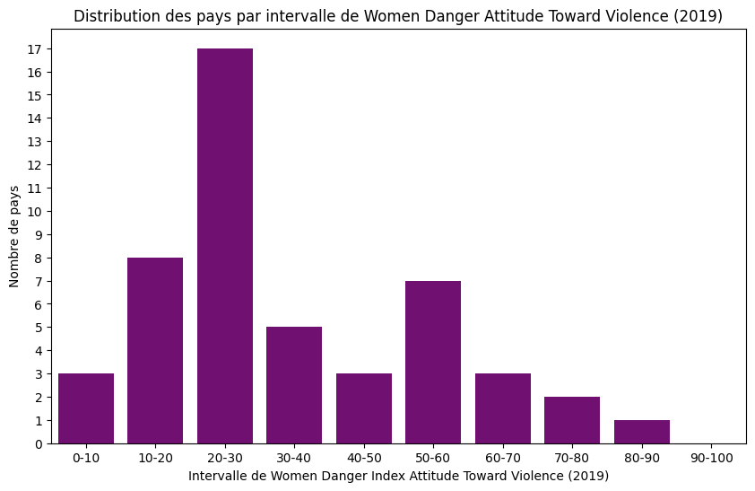

# PAYS LES PLUS DANGEREUX POUR LES FEMMES EN 2023

## Installation & Import


```python
import pandas as pd
import numpy as np
import re
import matplotlib.pyplot as plt
import seaborn as sns
```

## Création du DataFrame de base


```python
data = pd.read_csv("most-dangerous-countries-for-women-2024.csv", sep=",", low_memory=False)
```


```python
# Le séparateur est ","
```


```python
data_exo = data
```


```python
# Suppresion de "MostDangerousCountriesForWomen_" devant chaque catégories pour que le DF soit plus lisible
data_exo.columns = data_exo.columns.str.replace("MostDangerousCountriesForWomen_", "", regex=False)

```


```python
data_exo.info()
```

    <class 'pandas.core.frame.DataFrame'>
    RangeIndex: 176 entries, 0 to 175
    Data columns (total 12 columns):
     #   Column                                 Non-Null Count  Dtype  
    ---  ------                                 --------------  -----  
     0   country                                176 non-null    object 
     1   WomenPeaceAndSecurityIndex_Score_2023  176 non-null    float64
     2   WomensDangerIndexWDI_TotalScore_2019   50 non-null     float64
     3   WDIStreetSafety_2019                   50 non-null     float64
     4   WDIIntentionalHomicide_2019            50 non-null     float64
     5   WDINonPartnerViolence_2019             50 non-null     float64
     6   WDIIntimatePartnerViolence_2019        50 non-null     float64
     7   WDILegalDiscrimination_2019            50 non-null     float64
     8   WDIGlobalGenderGap_2019                50 non-null     float64
     9   WDIGenderInequality_2019               50 non-null     float64
     10  WDIAttitudesTowardViolence_2019        50 non-null     float64
     11  continent                              174 non-null    object 
    dtypes: float64(10), object(2)
    memory usage: 16.6+ KB


```python
data_exo.describe().T
```


<div>
<style scoped>
    .dataframe tbody tr th:only-of-type {
        vertical-align: middle;
    }

    .dataframe tbody tr th {
        vertical-align: top;
    }

    .dataframe thead th {
        text-align: right;
    }
</style>
<table border="1" class="dataframe">
  <thead>
    <tr style="text-align: right;">
      <th></th>
      <th>count</th>
      <th>mean</th>
      <th>std</th>
      <th>min</th>
      <th>25%</th>
      <th>50%</th>
      <th>75%</th>
      <th>max</th>
    </tr>
  </thead>
  <tbody>
    <tr>
      <th>WomenPeaceAndSecurityIndex_Score_2023</th>
      <td>176.0</td>
      <td>0.68033</td>
      <td>0.148371</td>
      <td>0.286</td>
      <td>0.5815</td>
      <td>0.6915</td>
      <td>0.7965</td>
      <td>0.932</td>
    </tr>
    <tr>
      <th>WomensDangerIndexWDI_TotalScore_2019</th>
      <td>50.0</td>
      <td>413.01160</td>
      <td>122.215655</td>
      <td>212.040</td>
      <td>312.6025</td>
      <td>394.5350</td>
      <td>514.9000</td>
      <td>771.820</td>
    </tr>
    <tr>
      <th>WDIStreetSafety_2019</th>
      <td>50.0</td>
      <td>53.74000</td>
      <td>21.562259</td>
      <td>9.000</td>
      <td>40.2500</td>
      <td>54.0000</td>
      <td>68.0000</td>
      <td>100.000</td>
    </tr>
    <tr>
      <th>WDIIntentionalHomicide_2019</th>
      <td>50.0</td>
      <td>15.56000</td>
      <td>18.417117</td>
      <td>3.000</td>
      <td>6.0000</td>
      <td>9.5000</td>
      <td>15.5000</td>
      <td>100.000</td>
    </tr>
    <tr>
      <th>WDINonPartnerViolence_2019</th>
      <td>50.0</td>
      <td>39.74000</td>
      <td>24.287235</td>
      <td>6.000</td>
      <td>23.7500</td>
      <td>30.0000</td>
      <td>62.0000</td>
      <td>100.000</td>
    </tr>
    <tr>
      <th>WDIIntimatePartnerViolence_2019</th>
      <td>50.0</td>
      <td>51.84000</td>
      <td>21.386969</td>
      <td>14.000</td>
      <td>32.2500</td>
      <td>48.0000</td>
      <td>65.5000</td>
      <td>100.000</td>
    </tr>
    <tr>
      <th>WDILegalDiscrimination_2019</th>
      <td>50.0</td>
      <td>36.44000</td>
      <td>20.111079</td>
      <td>15.000</td>
      <td>22.0000</td>
      <td>30.0000</td>
      <td>43.2500</td>
      <td>100.000</td>
    </tr>
    <tr>
      <th>WDIGlobalGenderGap_2019</th>
      <td>50.0</td>
      <td>70.58000</td>
      <td>13.800458</td>
      <td>41.000</td>
      <td>61.5000</td>
      <td>71.5000</td>
      <td>78.7500</td>
      <td>100.000</td>
    </tr>
    <tr>
      <th>WDIGenderInequality_2019</th>
      <td>50.0</td>
      <td>42.28000</td>
      <td>28.747344</td>
      <td>7.000</td>
      <td>17.0000</td>
      <td>38.5000</td>
      <td>64.0000</td>
      <td>100.000</td>
    </tr>
    <tr>
      <th>WDIAttitudesTowardViolence_2019</th>
      <td>50.0</td>
      <td>33.98000</td>
      <td>22.232987</td>
      <td>7.000</td>
      <td>20.0000</td>
      <td>24.0000</td>
      <td>51.7500</td>
      <td>100.000</td>
    </tr>
  </tbody>
</table>
</div>


```python
data_exo.describe(include="object").T
```


<div>
<style scoped>
    .dataframe tbody tr th:only-of-type {
        vertical-align: middle;
    }

    .dataframe tbody tr th {
        vertical-align: top;
    }

    .dataframe thead th {
        text-align: right;
    }
</style>
<table border="1" class="dataframe">
  <thead>
    <tr style="text-align: right;">
      <th></th>
      <th>count</th>
      <th>unique</th>
      <th>top</th>
      <th>freq</th>
    </tr>
  </thead>
  <tbody>
    <tr>
      <th>country</th>
      <td>176</td>
      <td>176</td>
      <td>Solomon Islands</td>
      <td>1</td>
    </tr>
    <tr>
      <th>continent</th>
      <td>174</td>
      <td>5</td>
      <td>Africa</td>
      <td>52</td>
    </tr>
  </tbody>
</table>
</div>


## Visualisation du taux de remplissage de chaque colonne

Liste des colonnes :


```python
data_exo.columns
```


    Index(['country', 'WomenPeaceAndSecurityIndex_Score_2023',
           'WomensDangerIndexWDI_TotalScore_2019', 'WDIStreetSafety_2019',
           'WDIIntentionalHomicide_2019', 'WDINonPartnerViolence_2019',
           'WDIIntimatePartnerViolence_2019', 'WDILegalDiscrimination_2019',
           'WDIGlobalGenderGap_2019', 'WDIGenderInequality_2019',
           'WDIAttitudesTowardViolence_2019', 'continent'],
          dtype='object')


On notera que la totalité des données, hormis celle de l'indice de Paix & Sécurité, datent de 2019


```python
# Calculer le taux de remplissage pour chaque colonne
column_fill_rates = data_exo.notna().mean() * 100

# Afficher le taux de remplissage pour chaque colonne
column_fill_rates
```


    country                                  100.000000
    WomenPeaceAndSecurityIndex_Score_2023    100.000000
    WomensDangerIndexWDI_TotalScore_2019      28.409091
    WDIStreetSafety_2019                      28.409091
    WDIIntentionalHomicide_2019               28.409091
    WDINonPartnerViolence_2019                28.409091
    WDIIntimatePartnerViolence_2019           28.409091
    WDILegalDiscrimination_2019               28.409091
    WDIGlobalGenderGap_2019                   28.409091
    WDIGenderInequality_2019                  28.409091
    WDIAttitudesTowardViolence_2019           28.409091
    continent                                 98.863636
    dtype: float64


Seule la colonne concernant l'indice de sécurité est totalement remplie.
Nous allons donc lister les pays dans lesquelles seule cette colonne est remplie
Nous allons donc commencer par regarder cet indice, puis écarter les pays qui ont uniquement cette colonne de remplie

## Visualisation de "WomenPeaceAndSecurityIndex_score_2023"


```python
# Créez le DataFrame
women_security_2023 = pd.DataFrame(data_exo, columns=["country", "WomenPeaceAndSecurityIndex_Score_2023", "continent"])

# Convertissez les scores en valeurs numériques, en remplaçant les valeurs invalides par NaN
women_security_2023["WomenPeaceAndSecurityIndex_Score_2023"] = pd.to_numeric(
    women_security_2023["WomenPeaceAndSecurityIndex_Score_2023"], errors='coerce'
)

# Définissez les seuils de 0.1 à 1.0
bins = [i / 10 for i in range(0, 11)]

# Comptez le nombre de pays dans chaque intervalle
counts = pd.cut(women_security_2023["WomenPeaceAndSecurityIndex_Score_2023"], bins=bins).value_counts().sort_index()

# Tracez le graphique en barres
counts.plot( color='skyblue')
plt.xlabel("Indice de Paix & Sécurité des Femmes")
plt.ylabel("Nombre de pays")
plt.title("Nombre de pays en fonction de l'Indice de Paix & Sécurité des Femmes en 2023")
plt.xticks(rotation=45)
plt.show()

```


    

    


On remarque que la majorité des pays ont un indice compris entre **0.55 et 0.75**


```python
df = pd.DataFrame(data_exo)

# Créer un diagramme box plot
plt.figure(figsize=(10, 6))
sns.boxplot(x='continent', y='WomenPeaceAndSecurityIndex_Score_2023', data=df)

# Personnalisation du graphique
plt.title("Distribution de l'indice Women Peace And Security par continent en 2023")
plt.xlabel("Continent")
plt.ylabel("Women Peace And Security Index Score 2023")
plt.xticks(rotation=45)
plt.tight_layout()

# Afficher le graphique
plt.show()
```


    

    


On remarque que l'**Europe** est le continent où l'indice de Sécurité des Femmes est le plus elevé en 2023, à l'exception d'un pays.


```python
data_europe_dangerous = women_security_2023[women_security_2023['continent'] == 'Europe']
max_europe_danger = data_europe_dangerous.sort_values(by="WomenPeaceAndSecurityIndex_Score_2023", ascending=True)
max_europe_danger.head(1)
```


<div>
<style scoped>
    .dataframe tbody tr th:only-of-type {
        vertical-align: middle;
    }

    .dataframe tbody tr th {
        vertical-align: top;
    }

    .dataframe thead th {
        text-align: right;
    }
</style>
<table border="1" class="dataframe">
  <thead>
    <tr style="text-align: right;">
      <th></th>
      <th>country</th>
      <th>WomenPeaceAndSecurityIndex_Score_2023</th>
      <th>continent</th>
    </tr>
  </thead>
  <tbody>
    <tr>
      <th>41</th>
      <td>Ukraine</td>
      <td>0.626</td>
      <td>Europe</td>
    </tr>
  </tbody>
</table>
</div>


Le pays Européen avec l'indice de Sécurité le plus faible est l'**Ukraine**. On peut supposer que si l'indice est si bas, c'est à cause de l'actualité géopolitique du pays.  
- [Guerre Russo-Ukrainienne](https://fr.wikipedia.org/wiki/Guerre_russo-ukrainienne) 


```python
data_asia_dangerous = women_security_2023[women_security_2023['continent'] == 'Asia']
max_asia_danger = data_asia_dangerous.sort_values(by="WomenPeaceAndSecurityIndex_Score_2023", ascending=True)
max_asia_danger.head(3)
```


<div>
<style scoped>
    .dataframe tbody tr th:only-of-type {
        vertical-align: middle;
    }

    .dataframe tbody tr th {
        vertical-align: top;
    }

    .dataframe thead th {
        text-align: right;
    }
</style>
<table border="1" class="dataframe">
  <thead>
    <tr style="text-align: right;">
      <th></th>
      <th>country</th>
      <th>WomenPeaceAndSecurityIndex_Score_2023</th>
      <th>continent</th>
    </tr>
  </thead>
  <tbody>
    <tr>
      <th>35</th>
      <td>Afghanistan</td>
      <td>0.286</td>
      <td>Asia</td>
    </tr>
    <tr>
      <th>36</th>
      <td>Yemen</td>
      <td>0.287</td>
      <td>Asia</td>
    </tr>
    <tr>
      <th>55</th>
      <td>Syria</td>
      <td>0.407</td>
      <td>Asia</td>
    </tr>
  </tbody>
</table>
</div>


Les 3 pays d'**Asie** ayant l'indice de sécurité les plus faibles sont : l'**Afghanistan**, le **Yemen**, la **Syrie**.
On notera, que comme en **Ukraine**, le **Yemen** et la **Syrie** sont en guerre. On peut supposer que l'indice de l'**Afghanistan** soit faible en raison des nombreuses guerres ayant eu lieu ces dernières années.
- [Guerre Civile Yéménite](https://fr.wikipedia.org/wiki/Guerre_civile_y%C3%A9m%C3%A9nite) 
- [Guerre Civil Syrienne](https://fr.wikipedia.org/wiki/Guerre_civile_syrienne) 
- [Guerres d'Afghanistan](https://fr.wikipedia.org/wiki/Guerre_d%27Afghanistan#:~:text=la%20guerre%20d'Afghanistan%2C%20de%202001%20%C3%A0%202021%2C%20est,am%C3%A9ricain%20et%20une%20victoire%20talibane.) 


```python
data_americas_dangerous = women_security_2023[women_security_2023['continent'] == 'Americas']
max_americas_danger = data_americas_dangerous.sort_values(by="WomenPeaceAndSecurityIndex_Score_2023", ascending=True)
max_americas_danger.head(3)
```


<div>
<style scoped>
    .dataframe tbody tr th:only-of-type {
        vertical-align: middle;
    }

    .dataframe tbody tr th {
        vertical-align: top;
    }

    .dataframe thead th {
        text-align: right;
    }
</style>
<table border="1" class="dataframe">
  <thead>
    <tr style="text-align: right;">
      <th></th>
      <th>country</th>
      <th>WomenPeaceAndSecurityIndex_Score_2023</th>
      <th>continent</th>
    </tr>
  </thead>
  <tbody>
    <tr>
      <th>80</th>
      <td>Haiti</td>
      <td>0.431</td>
      <td>Americas</td>
    </tr>
    <tr>
      <th>10</th>
      <td>Mexico</td>
      <td>0.551</td>
      <td>Americas</td>
    </tr>
    <tr>
      <th>109</th>
      <td>El Salvador</td>
      <td>0.566</td>
      <td>Americas</td>
    </tr>
  </tbody>
</table>
</div>


Les 3 pays d'**Amérique** ayant les indices de Sécurité les plus faibles sont **Haïti**, le **Mexique** et le **Salvador**.  
Ces 3 pays sont connus par la présence prépondérante de gang et de cartel de la drogue.


```python

widpc_max = women_security_2023["WomenPeaceAndSecurityIndex_Score_2023"].max()


women_danger_2023_max = women_security_2023.sort_values(by="WomenPeaceAndSecurityIndex_Score_2023", ascending=False)
women_danger_2023_max.head(1)
```


<div>
<style scoped>
    .dataframe tbody tr th:only-of-type {
        vertical-align: middle;
    }

    .dataframe tbody tr th {
        vertical-align: top;
    }

    .dataframe thead th {
        text-align: right;
    }
</style>
<table border="1" class="dataframe">
  <thead>
    <tr style="text-align: right;">
      <th></th>
      <th>country</th>
      <th>WomenPeaceAndSecurityIndex_Score_2023</th>
      <th>continent</th>
    </tr>
  </thead>
  <tbody>
    <tr>
      <th>111</th>
      <td>Denmark</td>
      <td>0.932</td>
      <td>Europe</td>
    </tr>
  </tbody>
</table>
</div>


```python

widpc_min = women_security_2023["WomenPeaceAndSecurityIndex_Score_2023"].min()


women_danger_2023_min = women_security_2023.sort_values(by="WomenPeaceAndSecurityIndex_Score_2023", ascending=True)
women_danger_2023_min.head(1)
```


<div>
<style scoped>
    .dataframe tbody tr th:only-of-type {
        vertical-align: middle;
    }

    .dataframe tbody tr th {
        vertical-align: top;
    }

    .dataframe thead th {
        text-align: right;
    }
</style>
<table border="1" class="dataframe">
  <thead>
    <tr style="text-align: right;">
      <th></th>
      <th>country</th>
      <th>WomenPeaceAndSecurityIndex_Score_2023</th>
      <th>continent</th>
    </tr>
  </thead>
  <tbody>
    <tr>
      <th>35</th>
      <td>Afghanistan</td>
      <td>0.286</td>
      <td>Asia</td>
    </tr>
  </tbody>
</table>
</div>


```python
women_danger_france =  women_security_2023[ women_security_2023['country'] == 'France']
women_danger_france
```


<div>
<style scoped>
    .dataframe tbody tr th:only-of-type {
        vertical-align: middle;
    }

    .dataframe tbody tr th {
        vertical-align: top;
    }

    .dataframe thead th {
        text-align: right;
    }
</style>
<table border="1" class="dataframe">
  <thead>
    <tr style="text-align: right;">
      <th></th>
      <th>country</th>
      <th>WomenPeaceAndSecurityIndex_Score_2023</th>
      <th>continent</th>
    </tr>
  </thead>
  <tbody>
    <tr>
      <th>22</th>
      <td>France</td>
      <td>0.864</td>
      <td>Europe</td>
    </tr>
  </tbody>
</table>
</div>


```python
women_danger_mean =  women_security_2023["WomenPeaceAndSecurityIndex_Score_2023"].mean()
women_danger_mean.round(4)
```


    0.6803


Le pays ayant l'indice de Sécurité le plus élevé est le **Danemark** en **Europe**, et le pays ayant l'indice le plus faible est l'**Afghanistan** en **Asie**.  
On notera que la **France** a un indice de sécurité de 0.864.  


```python
# Obtenir la liste des continents uniques
continents_list = data["continent"].unique()

# Grouper par continent et compter le nombre de pays
countries_per_continent = data_exo.groupby("continent").size()

countries_table = countries_per_continent.reset_index(name="num_countries")
countries_table.rename(columns={"continent": "Continent"}, inplace=True)
countries_table
```


<div>
<style scoped>
    .dataframe tbody tr th:only-of-type {
        vertical-align: middle;
    }

    .dataframe tbody tr th {
        vertical-align: top;
    }

    .dataframe thead th {
        text-align: right;
    }
</style>
<table border="1" class="dataframe">
  <thead>
    <tr style="text-align: right;">
      <th></th>
      <th>Continent</th>
      <th>num_countries</th>
    </tr>
  </thead>
  <tbody>
    <tr>
      <th>0</th>
      <td>Africa</td>
      <td>52</td>
    </tr>
    <tr>
      <th>1</th>
      <td>Americas</td>
      <td>28</td>
    </tr>
    <tr>
      <th>2</th>
      <td>Asia</td>
      <td>47</td>
    </tr>
    <tr>
      <th>3</th>
      <td>Europe</td>
      <td>39</td>
    </tr>
    <tr>
      <th>4</th>
      <td>Oceania</td>
      <td>8</td>
    </tr>
  </tbody>
</table>
</div>


```python
# Regardons maintenant les pays qui n'ont que cette colonne de remplie
```


```python
# Filtrer les pays où seule la colonne "WomenPeaceAndSecurityIndex_Score_2023" est remplie (avec 'country' et 'continent')
country_with_only_indice = data_exo[
    (data_exo.notna().sum(axis=1) == 3) &  # Seulement trois colonnes remplies ('country', 'continent', 'WomenPeaceAndSecurityIndex_Score_2023')
    (data_exo["WomenPeaceAndSecurityIndex_Score_2023"].notna())  # Cette colonne est non-NaN
]

# Obtenir le nombre de pays concernés par continent
countries_summary = (
    country_with_only_indice.groupby("continent")
    .size()
    .reset_index(name="num_countries")
    .rename(columns={"continent": "Continent"})
)

# Ajouter le total global comme ligne
total_countries = pd.DataFrame([{"Continent": "Total", "num_countries": len(country_with_only_indice)}])
countries_summary = pd.concat([countries_summary, total_countries], ignore_index=True)

# Afficher le tableau consolidé
countries_summary

```


<div>
<style scoped>
    .dataframe tbody tr th:only-of-type {
        vertical-align: middle;
    }

    .dataframe tbody tr th {
        vertical-align: top;
    }

    .dataframe thead th {
        text-align: right;
    }
</style>
<table border="1" class="dataframe">
  <thead>
    <tr style="text-align: right;">
      <th></th>
      <th>Continent</th>
      <th>num_countries</th>
    </tr>
  </thead>
  <tbody>
    <tr>
      <th>0</th>
      <td>Africa</td>
      <td>48</td>
    </tr>
    <tr>
      <th>1</th>
      <td>Americas</td>
      <td>21</td>
    </tr>
    <tr>
      <th>2</th>
      <td>Asia</td>
      <td>31</td>
    </tr>
    <tr>
      <th>3</th>
      <td>Europe</td>
      <td>18</td>
    </tr>
    <tr>
      <th>4</th>
      <td>Oceania</td>
      <td>7</td>
    </tr>
    <tr>
      <th>5</th>
      <td>Total</td>
      <td>125</td>
    </tr>
  </tbody>
</table>
</div>


```python
# Total des pays par continent
countries_per_continent = (
    data_exo.groupby("continent")
    .size()
    .reset_index(name="total_countries")
    .rename(columns={"continent": "Continent"})
)

# Pays avec seulement "WomenPeaceAndSecurityIndex_Score_2023" rempli
countries_with_only_index = (
    country_with_only_indice.groupby("continent")
    .size()
    .reset_index(name="countries_with_index_only")
    .rename(columns={"continent": "Continent"})
)

# Fusion des deux DataFrames
combined_summary = pd.merge(
    countries_per_continent,
    countries_with_only_index,
    on="Continent",
    how="outer"
).fillna(0)  # Remplir les valeurs manquantes avec 0

# Calcul de la différence
combined_summary["difference"] = combined_summary["total_countries"] - combined_summary["countries_with_index_only"]

# Ajouter une ligne pour le total global
total_row = pd.DataFrame({
    "Continent": ["Total"],
    "total_countries": [combined_summary["total_countries"].sum()],
    "countries_with_index_only": [combined_summary["countries_with_index_only"].sum()],
    "difference": [combined_summary["difference"].sum()]
})

# Ajouter la ligne du total au tableau
combined_summary = pd.concat([combined_summary, total_row], ignore_index=True)

# Afficher le tableau final
combined_summary

```


<div>
<style scoped>
    .dataframe tbody tr th:only-of-type {
        vertical-align: middle;
    }

    .dataframe tbody tr th {
        vertical-align: top;
    }

    .dataframe thead th {
        text-align: right;
    }
</style>
<table border="1" class="dataframe">
  <thead>
    <tr style="text-align: right;">
      <th></th>
      <th>Continent</th>
      <th>total_countries</th>
      <th>countries_with_index_only</th>
      <th>difference</th>
    </tr>
  </thead>
  <tbody>
    <tr>
      <th>0</th>
      <td>Africa</td>
      <td>52</td>
      <td>48</td>
      <td>4</td>
    </tr>
    <tr>
      <th>1</th>
      <td>Americas</td>
      <td>28</td>
      <td>21</td>
      <td>7</td>
    </tr>
    <tr>
      <th>2</th>
      <td>Asia</td>
      <td>47</td>
      <td>31</td>
      <td>16</td>
    </tr>
    <tr>
      <th>3</th>
      <td>Europe</td>
      <td>39</td>
      <td>18</td>
      <td>21</td>
    </tr>
    <tr>
      <th>4</th>
      <td>Oceania</td>
      <td>8</td>
      <td>7</td>
      <td>1</td>
    </tr>
    <tr>
      <th>5</th>
      <td>Total</td>
      <td>174</td>
      <td>125</td>
      <td>49</td>
    </tr>
  </tbody>
</table>
</div>


Il y a *seulement 49 pays* qui pourront être analyser correctement. Il sera difficile d'avoir un résultat vraiment pertinent.


```python
data_update= data_exo[~
    (data_exo.notna().sum(axis=1) == 3) &  # Seulement trois colonnes remplies ('country', 'continent', 'WomenPeaceAndSecurityIndex_Score_2023')
    (data_exo["WomenPeaceAndSecurityIndex_Score_2023"].notna())  # Cette colonne est non-NaN
]
```

## Visualisation "WomensDangerIndexWDI_TotalScore_2019"

**Nota:** plus le score est élevé, plus les femmes sont en danger.


```python
women_danger_2019 = pd.DataFrame(data_update, columns=["country","continent", "WomensDangerIndexWDI_TotalScore_2019"])
```


```python
women_danger_2019_sorted = women_danger_2019.sort_values(by="WomensDangerIndexWDI_TotalScore_2019", ascending=False)
women_danger_2019_sorted.head(10)
```


<div>
<style scoped>
    .dataframe tbody tr th:only-of-type {
        vertical-align: middle;
    }

    .dataframe tbody tr th {
        vertical-align: top;
    }

    .dataframe thead th {
        text-align: right;
    }
</style>
<table border="1" class="dataframe">
  <thead>
    <tr style="text-align: right;">
      <th></th>
      <th>country</th>
      <th>continent</th>
      <th>WomensDangerIndexWDI_TotalScore_2019</th>
    </tr>
  </thead>
  <tbody>
    <tr>
      <th>23</th>
      <td>South Africa</td>
      <td>Africa</td>
      <td>771.82</td>
    </tr>
    <tr>
      <th>6</th>
      <td>Brazil</td>
      <td>Americas</td>
      <td>624.28</td>
    </tr>
    <tr>
      <th>8</th>
      <td>Russia</td>
      <td>Europe</td>
      <td>592.71</td>
    </tr>
    <tr>
      <th>10</th>
      <td>Mexico</td>
      <td>Americas</td>
      <td>576.05</td>
    </tr>
    <tr>
      <th>16</th>
      <td>Iran</td>
      <td>Asia</td>
      <td>553.11</td>
    </tr>
    <tr>
      <th>83</th>
      <td>Dominican Republic</td>
      <td>Americas</td>
      <td>551.32</td>
    </tr>
    <tr>
      <th>12</th>
      <td>Egypt</td>
      <td>Africa</td>
      <td>546.91</td>
    </tr>
    <tr>
      <th>39</th>
      <td>Morocco</td>
      <td>Africa</td>
      <td>542.75</td>
    </tr>
    <tr>
      <th>0</th>
      <td>India</td>
      <td>Asia</td>
      <td>541.25</td>
    </tr>
    <tr>
      <th>19</th>
      <td>Thailand</td>
      <td>Asia</td>
      <td>533.22</td>
    </tr>
  </tbody>
</table>
</div>


```python
bins = [200, 250, 300, 350,  400, 450, 500, 550,  600,650,  700, 750, 800]
labels = ['200-250', '250-300', '300-350', '350-400', '400-450', '450-500', '500-550', '550-600', '600-650', '650-700', '700-750', '750-800']

# Ajouter une colonne 'interval' au DataFrame en utilisant pd.cut()
women_danger_2019['interval'] = pd.cut(women_danger_2019["WomensDangerIndexWDI_TotalScore_2019"], bins=bins, labels=labels, right=False)

# Compter le nombre de pays dans chaque intervalle
interval_counts = women_danger_2019['interval'].value_counts().sort_index()

# Créer un graphique à barres sans `hue`
plt.figure(figsize=(10, 6))
sns.barplot(x=interval_counts.index, y=interval_counts.values, color="purple")

# Ajouter des labels et un titre
plt.xlabel("Intervalle de Women Danger Index (2019)")
plt.ylabel("Nombre de pays")
plt.yticks(range(0, int(interval_counts.values.max()) + 1, 1))
plt.title("Distribution des pays par intervalle de Women Danger Index (2019)")

# Afficher le graphique
plt.show()

```


    

    


```python
# Filtrer pour les pays avec un indice inférieur à 300
data_exclude_interval = women_danger_2019.drop(columns=["interval"], errors='ignore')
indice_less_300 = data_exclude_interval[women_danger_2019["WomensDangerIndexWDI_TotalScore_2019"] < 300]

indice_less_300.sort_values(by="WomensDangerIndexWDI_TotalScore_2019", ascending=True)
```


<div>
<style scoped>
    .dataframe tbody tr th:only-of-type {
        vertical-align: middle;
    }

    .dataframe tbody tr th {
        vertical-align: top;
    }

    .dataframe thead th {
        text-align: right;
    }
</style>
<table border="1" class="dataframe">
  <thead>
    <tr style="text-align: right;">
      <th></th>
      <th>country</th>
      <th>continent</th>
      <th>WomensDangerIndexWDI_TotalScore_2019</th>
    </tr>
  </thead>
  <tbody>
    <tr>
      <th>31</th>
      <td>Spain</td>
      <td>Europe</td>
      <td>212.04</td>
    </tr>
    <tr>
      <th>112</th>
      <td>Singapore</td>
      <td>Asia</td>
      <td>245.26</td>
    </tr>
    <tr>
      <th>121</th>
      <td>Ireland</td>
      <td>Europe</td>
      <td>247.31</td>
    </tr>
    <tr>
      <th>96</th>
      <td>Austria</td>
      <td>Europe</td>
      <td>251.63</td>
    </tr>
    <tr>
      <th>98</th>
      <td>Switzerland</td>
      <td>Europe</td>
      <td>252.78</td>
    </tr>
    <tr>
      <th>116</th>
      <td>Norway</td>
      <td>Europe</td>
      <td>259.92</td>
    </tr>
    <tr>
      <th>90</th>
      <td>Portugal</td>
      <td>Europe</td>
      <td>277.58</td>
    </tr>
    <tr>
      <th>127</th>
      <td>Croatia</td>
      <td>Europe</td>
      <td>286.53</td>
    </tr>
    <tr>
      <th>37</th>
      <td>Canada</td>
      <td>Americas</td>
      <td>290.83</td>
    </tr>
    <tr>
      <th>38</th>
      <td>Poland</td>
      <td>Europe</td>
      <td>291.23</td>
    </tr>
    <tr>
      <th>20</th>
      <td>United Kingdom</td>
      <td>Europe</td>
      <td>296.85</td>
    </tr>
  </tbody>
</table>
</div>


```python
# Filtrer pour les pays avec un indice inférieur à 400
data_exclude_interval = women_danger_2019.drop(columns=["interval"], errors='ignore')
# Filtrer les pays dont l'indice est compris entre 300 et 400
indice_between_400_500 = data_exclude_interval[(women_danger_2019["WomensDangerIndexWDI_TotalScore_2019"] > 400) & 
                                                (women_danger_2019["WomensDangerIndexWDI_TotalScore_2019"] <= 500)]

# Trier les résultats par l'indice
indice_between_400_500.sort_values(by="WomensDangerIndexWDI_TotalScore_2019", ascending=True)

```


<div>
<style scoped>
    .dataframe tbody tr th:only-of-type {
        vertical-align: middle;
    }

    .dataframe tbody tr th {
        vertical-align: top;
    }

    .dataframe thead th {
        text-align: right;
    }
</style>
<table border="1" class="dataframe">
  <thead>
    <tr style="text-align: right;">
      <th></th>
      <th>country</th>
      <th>continent</th>
      <th>WomensDangerIndexWDI_TotalScore_2019</th>
    </tr>
  </thead>
  <tbody>
    <tr>
      <th>13</th>
      <td>Philippines</td>
      <td>Asia</td>
      <td>408.23</td>
    </tr>
    <tr>
      <th>3</th>
      <td>Indonesia</td>
      <td>Asia</td>
      <td>442.10</td>
    </tr>
    <tr>
      <th>1</th>
      <td>China</td>
      <td>Asia</td>
      <td>444.55</td>
    </tr>
    <tr>
      <th>15</th>
      <td>Vietnam</td>
      <td>Asia</td>
      <td>449.65</td>
    </tr>
    <tr>
      <th>84</th>
      <td>United Arab Emirates</td>
      <td>Asia</td>
      <td>450.66</td>
    </tr>
    <tr>
      <th>41</th>
      <td>Ukraine</td>
      <td>Europe</td>
      <td>453.61</td>
    </tr>
    <tr>
      <th>2</th>
      <td>United States</td>
      <td>Americas</td>
      <td>456.31</td>
    </tr>
    <tr>
      <th>78</th>
      <td>Tunisia</td>
      <td>Africa</td>
      <td>468.26</td>
    </tr>
    <tr>
      <th>149</th>
      <td>Bahrain</td>
      <td>Asia</td>
      <td>476.09</td>
    </tr>
    <tr>
      <th>71</th>
      <td>Cambodia</td>
      <td>Asia</td>
      <td>485.73</td>
    </tr>
    <tr>
      <th>64</th>
      <td>Chile</td>
      <td>Americas</td>
      <td>487.96</td>
    </tr>
    <tr>
      <th>34</th>
      <td>Argentina</td>
      <td>Americas</td>
      <td>494.11</td>
    </tr>
  </tbody>
</table>
</div>


```python
# Filtrer pour les pays avec un indice inférieur à 400
data_exclude_interval = women_danger_2019.drop(columns=["interval"], errors='ignore')
# Filtrer les pays dont l'indice est compris entre 300 et 400
indice_between_300_400 = data_exclude_interval[(women_danger_2019["WomensDangerIndexWDI_TotalScore_2019"] > 300) & 
                                                (women_danger_2019["WomensDangerIndexWDI_TotalScore_2019"] <= 400)]

# Trier les résultats par l'indice
indice_between_300_400.sort_values(by="WomensDangerIndexWDI_TotalScore_2019", ascending=True)

```


<div>
<style scoped>
    .dataframe tbody tr th:only-of-type {
        vertical-align: middle;
    }

    .dataframe tbody tr th {
        vertical-align: top;
    }

    .dataframe thead th {
        text-align: right;
    }
</style>
<table border="1" class="dataframe">
  <thead>
    <tr style="text-align: right;">
      <th></th>
      <th>country</th>
      <th>continent</th>
      <th>WomensDangerIndexWDI_TotalScore_2019</th>
    </tr>
  </thead>
  <tbody>
    <tr>
      <th>69</th>
      <td>Netherlands</td>
      <td>Europe</td>
      <td>302.81</td>
    </tr>
    <tr>
      <th>22</th>
      <td>France</td>
      <td>Europe</td>
      <td>309.92</td>
    </tr>
    <tr>
      <th>111</th>
      <td>Denmark</td>
      <td>Europe</td>
      <td>320.65</td>
    </tr>
    <tr>
      <th>24</th>
      <td>Italy</td>
      <td>Europe</td>
      <td>323.19</td>
    </tr>
    <tr>
      <th>86</th>
      <td>Czech Republic</td>
      <td>NaN</td>
      <td>325.33</td>
    </tr>
    <tr>
      <th>87</th>
      <td>Sweden</td>
      <td>Europe</td>
      <td>326.42</td>
    </tr>
    <tr>
      <th>18</th>
      <td>Germany</td>
      <td>Europe</td>
      <td>335.10</td>
    </tr>
    <tr>
      <th>92</th>
      <td>Greece</td>
      <td>Europe</td>
      <td>337.80</td>
    </tr>
    <tr>
      <th>11</th>
      <td>Japan</td>
      <td>Asia</td>
      <td>366.20</td>
    </tr>
    <tr>
      <th>28</th>
      <td>South Korea</td>
      <td>Asia</td>
      <td>366.98</td>
    </tr>
    <tr>
      <th>54</th>
      <td>Australia</td>
      <td>Oceania</td>
      <td>370.10</td>
    </tr>
    <tr>
      <th>81</th>
      <td>Belgium</td>
      <td>Europe</td>
      <td>372.88</td>
    </tr>
    <tr>
      <th>93</th>
      <td>Hungary</td>
      <td>Europe</td>
      <td>375.89</td>
    </tr>
    <tr>
      <th>107</th>
      <td>Bulgaria</td>
      <td>Europe</td>
      <td>380.84</td>
    </tr>
  </tbody>
</table>
</div>


```python
# Filtrer pour les pays avec un indice inférieur à 400
data_exclude_interval = women_danger_2019.drop(columns=["interval"], errors='ignore')
# Filtrer les pays dont l'indice est compris entre 400 et 500
indice_between_400_500 = data_exclude_interval[(women_danger_2019["WomensDangerIndexWDI_TotalScore_2019"] > 400) & 
                                                (women_danger_2019["WomensDangerIndexWDI_TotalScore_2019"] <= 500)]

# Trier les résultats par l'indice
indice_between_400_500.sort_values(by="WomensDangerIndexWDI_TotalScore_2019", ascending=True)

```


<div>
<style scoped>
    .dataframe tbody tr th:only-of-type {
        vertical-align: middle;
    }

    .dataframe tbody tr th {
        vertical-align: top;
    }

    .dataframe thead th {
        text-align: right;
    }
</style>
<table border="1" class="dataframe">
  <thead>
    <tr style="text-align: right;">
      <th></th>
      <th>country</th>
      <th>continent</th>
      <th>WomensDangerIndexWDI_TotalScore_2019</th>
    </tr>
  </thead>
  <tbody>
    <tr>
      <th>13</th>
      <td>Philippines</td>
      <td>Asia</td>
      <td>408.23</td>
    </tr>
    <tr>
      <th>3</th>
      <td>Indonesia</td>
      <td>Asia</td>
      <td>442.10</td>
    </tr>
    <tr>
      <th>1</th>
      <td>China</td>
      <td>Asia</td>
      <td>444.55</td>
    </tr>
    <tr>
      <th>15</th>
      <td>Vietnam</td>
      <td>Asia</td>
      <td>449.65</td>
    </tr>
    <tr>
      <th>84</th>
      <td>United Arab Emirates</td>
      <td>Asia</td>
      <td>450.66</td>
    </tr>
    <tr>
      <th>41</th>
      <td>Ukraine</td>
      <td>Europe</td>
      <td>453.61</td>
    </tr>
    <tr>
      <th>2</th>
      <td>United States</td>
      <td>Americas</td>
      <td>456.31</td>
    </tr>
    <tr>
      <th>78</th>
      <td>Tunisia</td>
      <td>Africa</td>
      <td>468.26</td>
    </tr>
    <tr>
      <th>149</th>
      <td>Bahrain</td>
      <td>Asia</td>
      <td>476.09</td>
    </tr>
    <tr>
      <th>71</th>
      <td>Cambodia</td>
      <td>Asia</td>
      <td>485.73</td>
    </tr>
    <tr>
      <th>64</th>
      <td>Chile</td>
      <td>Americas</td>
      <td>487.96</td>
    </tr>
    <tr>
      <th>34</th>
      <td>Argentina</td>
      <td>Americas</td>
      <td>494.11</td>
    </tr>
  </tbody>
</table>
</div>


```python
# Filtrer pour les pays avec un indice supérieur à 500
data_exclude_interval = women_danger_2019.drop(columns=["interval"], errors='ignore')
indice_less_500 = data_exclude_interval[women_danger_2019["WomensDangerIndexWDI_TotalScore_2019"] > 500]

indice_less_500.sort_values(by="WomensDangerIndexWDI_TotalScore_2019", ascending=True)
```


<div>
<style scoped>
    .dataframe tbody tr th:only-of-type {
        vertical-align: middle;
    }

    .dataframe tbody tr th {
        vertical-align: top;
    }

    .dataframe thead th {
        text-align: right;
    }
</style>
<table border="1" class="dataframe">
  <thead>
    <tr style="text-align: right;">
      <th></th>
      <th>country</th>
      <th>continent</th>
      <th>WomensDangerIndexWDI_TotalScore_2019</th>
    </tr>
  </thead>
  <tbody>
    <tr>
      <th>17</th>
      <td>Turkey</td>
      <td>Asia</td>
      <td>521.83</td>
    </tr>
    <tr>
      <th>47</th>
      <td>Saudi Arabia</td>
      <td>Asia</td>
      <td>524.36</td>
    </tr>
    <tr>
      <th>43</th>
      <td>Malaysia</td>
      <td>Asia</td>
      <td>527.64</td>
    </tr>
    <tr>
      <th>19</th>
      <td>Thailand</td>
      <td>Asia</td>
      <td>533.22</td>
    </tr>
    <tr>
      <th>0</th>
      <td>India</td>
      <td>Asia</td>
      <td>541.25</td>
    </tr>
    <tr>
      <th>39</th>
      <td>Morocco</td>
      <td>Africa</td>
      <td>542.75</td>
    </tr>
    <tr>
      <th>12</th>
      <td>Egypt</td>
      <td>Africa</td>
      <td>546.91</td>
    </tr>
    <tr>
      <th>83</th>
      <td>Dominican Republic</td>
      <td>Americas</td>
      <td>551.32</td>
    </tr>
    <tr>
      <th>16</th>
      <td>Iran</td>
      <td>Asia</td>
      <td>553.11</td>
    </tr>
    <tr>
      <th>10</th>
      <td>Mexico</td>
      <td>Americas</td>
      <td>576.05</td>
    </tr>
    <tr>
      <th>8</th>
      <td>Russia</td>
      <td>Europe</td>
      <td>592.71</td>
    </tr>
    <tr>
      <th>6</th>
      <td>Brazil</td>
      <td>Americas</td>
      <td>624.28</td>
    </tr>
    <tr>
      <th>23</th>
      <td>South Africa</td>
      <td>Africa</td>
      <td>771.82</td>
    </tr>
  </tbody>
</table>
</div>


## Visualisation de WDIStreetSafety_2019


```python
women_dangerstreetsafety_2019 = pd.DataFrame(data_update, columns=["country", "continent", "WDIStreetSafety_2019"])
women_dangerstreetsafety_2019.sort_values(by="WDIStreetSafety_2019", ascending = False).head(10)
```


<div>
<style scoped>
    .dataframe tbody tr th:only-of-type {
        vertical-align: middle;
    }

    .dataframe tbody tr th {
        vertical-align: top;
    }

    .dataframe thead th {
        text-align: right;
    }
</style>
<table border="1" class="dataframe">
  <thead>
    <tr style="text-align: right;">
      <th></th>
      <th>country</th>
      <th>continent</th>
      <th>WDIStreetSafety_2019</th>
    </tr>
  </thead>
  <tbody>
    <tr>
      <th>23</th>
      <td>South Africa</td>
      <td>Africa</td>
      <td>100.0</td>
    </tr>
    <tr>
      <th>6</th>
      <td>Brazil</td>
      <td>Americas</td>
      <td>96.0</td>
    </tr>
    <tr>
      <th>34</th>
      <td>Argentina</td>
      <td>Americas</td>
      <td>92.0</td>
    </tr>
    <tr>
      <th>10</th>
      <td>Mexico</td>
      <td>Americas</td>
      <td>89.0</td>
    </tr>
    <tr>
      <th>83</th>
      <td>Dominican Republic</td>
      <td>Americas</td>
      <td>89.0</td>
    </tr>
    <tr>
      <th>64</th>
      <td>Chile</td>
      <td>Americas</td>
      <td>81.0</td>
    </tr>
    <tr>
      <th>41</th>
      <td>Ukraine</td>
      <td>Europe</td>
      <td>81.0</td>
    </tr>
    <tr>
      <th>17</th>
      <td>Turkey</td>
      <td>Asia</td>
      <td>72.0</td>
    </tr>
    <tr>
      <th>43</th>
      <td>Malaysia</td>
      <td>Asia</td>
      <td>72.0</td>
    </tr>
    <tr>
      <th>12</th>
      <td>Egypt</td>
      <td>Africa</td>
      <td>71.0</td>
    </tr>
  </tbody>
</table>
</div>


```python
bins = [0, 10 ,20, 30, 40, 50, 60, 70 ,80,90,100]
labels = ['0-10', '10-20', '20-30', '30-40', '40-50' ,'50-60', '60-70', '70-80', '80-90', '90-100']
# Ajouter une colonne 'interval' au DataFrame en utilisant pd.cut()
women_dangerstreetsafety_2019['interval'] = pd.cut(women_dangerstreetsafety_2019["WDIStreetSafety_2019"], bins=bins, labels=labels, right=False)

# Compter le nombre de pays dans chaque intervalle
interval_counts = women_dangerstreetsafety_2019['interval'].value_counts().sort_index()

# Créer un graphique à barres sans `hue`
plt.figure(figsize=(10, 6))
sns.barplot(x=interval_counts.index, y=interval_counts.values, color="purple")

# Ajouter des labels et un titre
plt.xlabel("Intervalle de Women Danger Index Street Safety (2019)")
plt.ylabel("Nombre de pays")
plt.yticks(range(0, int(interval_counts.values.max()) + 1, 1))
plt.title("Distribution des pays par intervalle de Women Danger Index Street Safety (2019)")

# Afficher le graphique
plt.show()
```


    

    


```python
# Filtrer pour les pays avec un indice inférieur à 30
data_exclude_interval = women_dangerstreetsafety_2019.drop(columns=["interval"], errors='ignore')
indice_less_30 = data_exclude_interval[women_dangerstreetsafety_2019["WDIStreetSafety_2019"] < 30]

indice_less_30.sort_values(by="WDIStreetSafety_2019", ascending=True)
```


<div>
<style scoped>
    .dataframe tbody tr th:only-of-type {
        vertical-align: middle;
    }

    .dataframe tbody tr th {
        vertical-align: top;
    }

    .dataframe thead th {
        text-align: right;
    }
</style>
<table border="1" class="dataframe">
  <thead>
    <tr style="text-align: right;">
      <th></th>
      <th>country</th>
      <th>continent</th>
      <th>WDIStreetSafety_2019</th>
    </tr>
  </thead>
  <tbody>
    <tr>
      <th>112</th>
      <td>Singapore</td>
      <td>Asia</td>
      <td>9.0</td>
    </tr>
    <tr>
      <th>98</th>
      <td>Switzerland</td>
      <td>Europe</td>
      <td>15.0</td>
    </tr>
    <tr>
      <th>116</th>
      <td>Norway</td>
      <td>Europe</td>
      <td>16.0</td>
    </tr>
    <tr>
      <th>1</th>
      <td>China</td>
      <td>Asia</td>
      <td>23.0</td>
    </tr>
    <tr>
      <th>31</th>
      <td>Spain</td>
      <td>Europe</td>
      <td>24.0</td>
    </tr>
    <tr>
      <th>96</th>
      <td>Austria</td>
      <td>Europe</td>
      <td>27.0</td>
    </tr>
    <tr>
      <th>111</th>
      <td>Denmark</td>
      <td>Europe</td>
      <td>28.0</td>
    </tr>
  </tbody>
</table>
</div>


```python
# Filtrer pour les pays avec un indice compris entre 30 & 50 
data_exclude_interval = women_dangerstreetsafety_2019.drop(columns=["interval"], errors='ignore')
indice_between_30_50 = data_exclude_interval[(women_dangerstreetsafety_2019["WDIStreetSafety_2019"] > 30) & 
                    (women_dangerstreetsafety_2019["WDIStreetSafety_2019"] <=50)]
indice_between_30_50.sort_values(by="WDIStreetSafety_2019", ascending=True)

```


<div>
<style scoped>
    .dataframe tbody tr th:only-of-type {
        vertical-align: middle;
    }

    .dataframe tbody tr th {
        vertical-align: top;
    }

    .dataframe thead th {
        text-align: right;
    }
</style>
<table border="1" class="dataframe">
  <thead>
    <tr style="text-align: right;">
      <th></th>
      <th>country</th>
      <th>continent</th>
      <th>WDIStreetSafety_2019</th>
    </tr>
  </thead>
  <tbody>
    <tr>
      <th>20</th>
      <td>United Kingdom</td>
      <td>Europe</td>
      <td>31.0</td>
    </tr>
    <tr>
      <th>69</th>
      <td>Netherlands</td>
      <td>Europe</td>
      <td>32.0</td>
    </tr>
    <tr>
      <th>121</th>
      <td>Ireland</td>
      <td>Europe</td>
      <td>35.0</td>
    </tr>
    <tr>
      <th>37</th>
      <td>Canada</td>
      <td>Americas</td>
      <td>35.0</td>
    </tr>
    <tr>
      <th>3</th>
      <td>Indonesia</td>
      <td>Asia</td>
      <td>37.0</td>
    </tr>
    <tr>
      <th>22</th>
      <td>France</td>
      <td>Europe</td>
      <td>40.0</td>
    </tr>
    <tr>
      <th>0</th>
      <td>India</td>
      <td>Asia</td>
      <td>41.0</td>
    </tr>
    <tr>
      <th>18</th>
      <td>Germany</td>
      <td>Europe</td>
      <td>41.0</td>
    </tr>
    <tr>
      <th>127</th>
      <td>Croatia</td>
      <td>Europe</td>
      <td>43.0</td>
    </tr>
    <tr>
      <th>87</th>
      <td>Sweden</td>
      <td>Europe</td>
      <td>44.0</td>
    </tr>
    <tr>
      <th>19</th>
      <td>Thailand</td>
      <td>Asia</td>
      <td>45.0</td>
    </tr>
    <tr>
      <th>11</th>
      <td>Japan</td>
      <td>Asia</td>
      <td>47.0</td>
    </tr>
    <tr>
      <th>90</th>
      <td>Portugal</td>
      <td>Europe</td>
      <td>47.0</td>
    </tr>
    <tr>
      <th>86</th>
      <td>Czech Republic</td>
      <td>NaN</td>
      <td>47.0</td>
    </tr>
  </tbody>
</table>
</div>


```python
# Filtrer pour les pays avec un indice compris entre 50 & 70 
data_exclude_interval = women_dangerstreetsafety_2019.drop(columns=["interval"], errors='ignore')
indice_between_50_70 = data_exclude_interval[(women_dangerstreetsafety_2019["WDIStreetSafety_2019"] > 50) & 
                    (women_dangerstreetsafety_2019["WDIStreetSafety_2019"] <=70)]
indice_between_50_70.sort_values(by="WDIStreetSafety_2019", ascending=True)

```


<div>
<style scoped>
    .dataframe tbody tr th:only-of-type {
        vertical-align: middle;
    }

    .dataframe tbody tr th {
        vertical-align: top;
    }

    .dataframe thead th {
        text-align: right;
    }
</style>
<table border="1" class="dataframe">
  <thead>
    <tr style="text-align: right;">
      <th></th>
      <th>country</th>
      <th>continent</th>
      <th>WDIStreetSafety_2019</th>
    </tr>
  </thead>
  <tbody>
    <tr>
      <th>2</th>
      <td>United States</td>
      <td>Americas</td>
      <td>51.0</td>
    </tr>
    <tr>
      <th>28</th>
      <td>South Korea</td>
      <td>Asia</td>
      <td>51.0</td>
    </tr>
    <tr>
      <th>84</th>
      <td>United Arab Emirates</td>
      <td>Asia</td>
      <td>51.0</td>
    </tr>
    <tr>
      <th>38</th>
      <td>Poland</td>
      <td>Europe</td>
      <td>53.0</td>
    </tr>
    <tr>
      <th>13</th>
      <td>Philippines</td>
      <td>Asia</td>
      <td>55.0</td>
    </tr>
    <tr>
      <th>47</th>
      <td>Saudi Arabia</td>
      <td>Asia</td>
      <td>56.0</td>
    </tr>
    <tr>
      <th>54</th>
      <td>Australia</td>
      <td>Oceania</td>
      <td>57.0</td>
    </tr>
    <tr>
      <th>93</th>
      <td>Hungary</td>
      <td>Europe</td>
      <td>57.0</td>
    </tr>
    <tr>
      <th>39</th>
      <td>Morocco</td>
      <td>Africa</td>
      <td>59.0</td>
    </tr>
    <tr>
      <th>24</th>
      <td>Italy</td>
      <td>Europe</td>
      <td>59.0</td>
    </tr>
    <tr>
      <th>107</th>
      <td>Bulgaria</td>
      <td>Europe</td>
      <td>61.0</td>
    </tr>
    <tr>
      <th>15</th>
      <td>Vietnam</td>
      <td>Asia</td>
      <td>63.0</td>
    </tr>
    <tr>
      <th>78</th>
      <td>Tunisia</td>
      <td>Africa</td>
      <td>63.0</td>
    </tr>
    <tr>
      <th>81</th>
      <td>Belgium</td>
      <td>Europe</td>
      <td>63.0</td>
    </tr>
    <tr>
      <th>149</th>
      <td>Bahrain</td>
      <td>Asia</td>
      <td>64.0</td>
    </tr>
    <tr>
      <th>71</th>
      <td>Cambodia</td>
      <td>Asia</td>
      <td>65.0</td>
    </tr>
    <tr>
      <th>8</th>
      <td>Russia</td>
      <td>Europe</td>
      <td>69.0</td>
    </tr>
    <tr>
      <th>16</th>
      <td>Iran</td>
      <td>Asia</td>
      <td>69.0</td>
    </tr>
  </tbody>
</table>
</div>


```python
# Filtrer pour les pays avec un indice supérieur à 70
data_exclude_interval = women_dangerstreetsafety_2019.drop(columns=["interval"], errors='ignore')
indice_more_30 = data_exclude_interval[women_dangerstreetsafety_2019["WDIStreetSafety_2019"] > 70]

indice_more_30.sort_values(by="WDIStreetSafety_2019", ascending=True)
```


<div>
<style scoped>
    .dataframe tbody tr th:only-of-type {
        vertical-align: middle;
    }

    .dataframe tbody tr th {
        vertical-align: top;
    }

    .dataframe thead th {
        text-align: right;
    }
</style>
<table border="1" class="dataframe">
  <thead>
    <tr style="text-align: right;">
      <th></th>
      <th>country</th>
      <th>continent</th>
      <th>WDIStreetSafety_2019</th>
    </tr>
  </thead>
  <tbody>
    <tr>
      <th>12</th>
      <td>Egypt</td>
      <td>Africa</td>
      <td>71.0</td>
    </tr>
    <tr>
      <th>92</th>
      <td>Greece</td>
      <td>Europe</td>
      <td>71.0</td>
    </tr>
    <tr>
      <th>43</th>
      <td>Malaysia</td>
      <td>Asia</td>
      <td>72.0</td>
    </tr>
    <tr>
      <th>17</th>
      <td>Turkey</td>
      <td>Asia</td>
      <td>72.0</td>
    </tr>
    <tr>
      <th>64</th>
      <td>Chile</td>
      <td>Americas</td>
      <td>81.0</td>
    </tr>
    <tr>
      <th>41</th>
      <td>Ukraine</td>
      <td>Europe</td>
      <td>81.0</td>
    </tr>
    <tr>
      <th>10</th>
      <td>Mexico</td>
      <td>Americas</td>
      <td>89.0</td>
    </tr>
    <tr>
      <th>83</th>
      <td>Dominican Republic</td>
      <td>Americas</td>
      <td>89.0</td>
    </tr>
    <tr>
      <th>34</th>
      <td>Argentina</td>
      <td>Americas</td>
      <td>92.0</td>
    </tr>
    <tr>
      <th>6</th>
      <td>Brazil</td>
      <td>Americas</td>
      <td>96.0</td>
    </tr>
    <tr>
      <th>23</th>
      <td>South Africa</td>
      <td>Africa</td>
      <td>100.0</td>
    </tr>
  </tbody>
</table>
</div>


## Visualisation de WDIIntentionalHomicide_2019


```python
women_homicide_2019 = pd.DataFrame(data_update, columns=["country", "continent", "WDIIntentionalHomicide_2019"])
women_homicide_2019.sort_values(by="WDIIntentionalHomicide_2019", ascending = False).head(10)
```


<div>
<style scoped>
    .dataframe tbody tr th:only-of-type {
        vertical-align: middle;
    }

    .dataframe tbody tr th {
        vertical-align: top;
    }

    .dataframe thead th {
        text-align: right;
    }
</style>
<table border="1" class="dataframe">
  <thead>
    <tr style="text-align: right;">
      <th></th>
      <th>country</th>
      <th>continent</th>
      <th>WDIIntentionalHomicide_2019</th>
    </tr>
  </thead>
  <tbody>
    <tr>
      <th>23</th>
      <td>South Africa</td>
      <td>Africa</td>
      <td>100.0</td>
    </tr>
    <tr>
      <th>8</th>
      <td>Russia</td>
      <td>Europe</td>
      <td>77.0</td>
    </tr>
    <tr>
      <th>10</th>
      <td>Mexico</td>
      <td>Americas</td>
      <td>49.0</td>
    </tr>
    <tr>
      <th>6</th>
      <td>Brazil</td>
      <td>Americas</td>
      <td>49.0</td>
    </tr>
    <tr>
      <th>83</th>
      <td>Dominican Republic</td>
      <td>Americas</td>
      <td>35.0</td>
    </tr>
    <tr>
      <th>0</th>
      <td>India</td>
      <td>Asia</td>
      <td>30.0</td>
    </tr>
    <tr>
      <th>41</th>
      <td>Ukraine</td>
      <td>Europe</td>
      <td>27.0</td>
    </tr>
    <tr>
      <th>13</th>
      <td>Philippines</td>
      <td>Asia</td>
      <td>25.0</td>
    </tr>
    <tr>
      <th>2</th>
      <td>United States</td>
      <td>Americas</td>
      <td>25.0</td>
    </tr>
    <tr>
      <th>34</th>
      <td>Argentina</td>
      <td>Americas</td>
      <td>19.0</td>
    </tr>
  </tbody>
</table>
</div>


```python
bins = [0, 10 ,20, 30, 40, 50, 60, 70 ,80,90,100]
labels = ['0-10', '10-20', '20-30', '30-40', '40-50' ,'50-60', '60-70', '70-80', '80-90', '90-100']
# Ajouter une colonne 'interval' au DataFrame en utilisant pd.cut()
women_homicide_2019['interval'] = pd.cut(women_homicide_2019["WDIIntentionalHomicide_2019"], bins=bins, labels=labels, right=False)

# Compter le nombre de pays dans chaque intervalle
interval_counts = women_homicide_2019['interval'].value_counts().sort_index()

# Créer un graphique à barres sans `hue`
plt.figure(figsize=(10, 6))
sns.barplot(x=interval_counts.index, y=interval_counts.values, color="purple")

# Ajouter des labels et un titre
plt.xlabel("Intervalle de Women Danger Index Intentional Homicide (2019)")
plt.ylabel("Nombre de pays")
plt.yticks(range(0, int(interval_counts.values.max()) + 1, 1))
plt.title("Distribution des pays par intervalle de Women Danger Index Intentional Homicide (2019)")

# Afficher le graphique
plt.show()
```


    

    


```python
# Filtrer pour les pays avec un indice inférieur à 10
data_exclude_interval = women_homicide_2019.drop(columns=["interval"], errors='ignore')
indice_less_10 = data_exclude_interval[women_homicide_2019["WDIIntentionalHomicide_2019"] < 10]

indice_less_10.sort_values(by="WDIIntentionalHomicide_2019", ascending=True)
```


<div>
<style scoped>
    .dataframe tbody tr th:only-of-type {
        vertical-align: middle;
    }

    .dataframe tbody tr th {
        vertical-align: top;
    }

    .dataframe thead th {
        text-align: right;
    }
</style>
<table border="1" class="dataframe">
  <thead>
    <tr style="text-align: right;">
      <th></th>
      <th>country</th>
      <th>continent</th>
      <th>WDIIntentionalHomicide_2019</th>
    </tr>
  </thead>
  <tbody>
    <tr>
      <th>3</th>
      <td>Indonesia</td>
      <td>Asia</td>
      <td>3.0</td>
    </tr>
    <tr>
      <th>11</th>
      <td>Japan</td>
      <td>Asia</td>
      <td>3.0</td>
    </tr>
    <tr>
      <th>69</th>
      <td>Netherlands</td>
      <td>Europe</td>
      <td>4.0</td>
    </tr>
    <tr>
      <th>38</th>
      <td>Poland</td>
      <td>Europe</td>
      <td>4.0</td>
    </tr>
    <tr>
      <th>121</th>
      <td>Ireland</td>
      <td>Europe</td>
      <td>4.0</td>
    </tr>
    <tr>
      <th>31</th>
      <td>Spain</td>
      <td>Europe</td>
      <td>5.0</td>
    </tr>
    <tr>
      <th>24</th>
      <td>Italy</td>
      <td>Europe</td>
      <td>5.0</td>
    </tr>
    <tr>
      <th>15</th>
      <td>Vietnam</td>
      <td>Asia</td>
      <td>5.0</td>
    </tr>
    <tr>
      <th>116</th>
      <td>Norway</td>
      <td>Europe</td>
      <td>5.0</td>
    </tr>
    <tr>
      <th>112</th>
      <td>Singapore</td>
      <td>Asia</td>
      <td>5.0</td>
    </tr>
    <tr>
      <th>92</th>
      <td>Greece</td>
      <td>Europe</td>
      <td>5.0</td>
    </tr>
    <tr>
      <th>1</th>
      <td>China</td>
      <td>Asia</td>
      <td>6.0</td>
    </tr>
    <tr>
      <th>71</th>
      <td>Cambodia</td>
      <td>Asia</td>
      <td>6.0</td>
    </tr>
    <tr>
      <th>39</th>
      <td>Morocco</td>
      <td>Africa</td>
      <td>6.0</td>
    </tr>
    <tr>
      <th>54</th>
      <td>Australia</td>
      <td>Oceania</td>
      <td>7.0</td>
    </tr>
    <tr>
      <th>12</th>
      <td>Egypt</td>
      <td>Africa</td>
      <td>7.0</td>
    </tr>
    <tr>
      <th>107</th>
      <td>Bulgaria</td>
      <td>Europe</td>
      <td>7.0</td>
    </tr>
    <tr>
      <th>98</th>
      <td>Switzerland</td>
      <td>Europe</td>
      <td>7.0</td>
    </tr>
    <tr>
      <th>87</th>
      <td>Sweden</td>
      <td>Europe</td>
      <td>7.0</td>
    </tr>
    <tr>
      <th>86</th>
      <td>Czech Republic</td>
      <td>NaN</td>
      <td>7.0</td>
    </tr>
    <tr>
      <th>28</th>
      <td>South Korea</td>
      <td>Asia</td>
      <td>8.0</td>
    </tr>
    <tr>
      <th>43</th>
      <td>Malaysia</td>
      <td>Asia</td>
      <td>8.0</td>
    </tr>
    <tr>
      <th>96</th>
      <td>Austria</td>
      <td>Europe</td>
      <td>8.0</td>
    </tr>
    <tr>
      <th>37</th>
      <td>Canada</td>
      <td>Americas</td>
      <td>9.0</td>
    </tr>
    <tr>
      <th>111</th>
      <td>Denmark</td>
      <td>Europe</td>
      <td>9.0</td>
    </tr>
  </tbody>
</table>
</div>


```python
# Filtrer pour les pays avec un indice entre 10 & 20 
data_exclude_interval = women_homicide_2019.drop(columns=["interval"], errors='ignore')
indice_between_10_20 = data_exclude_interval[(women_homicide_2019["WDIIntentionalHomicide_2019"] > 10) &
                                        (women_homicide_2019["WDIIntentionalHomicide_2019"] <=20)]


indice_between_10_20.sort_values(by="WDIIntentionalHomicide_2019", ascending=True)
```


<div>
<style scoped>
    .dataframe tbody tr th:only-of-type {
        vertical-align: middle;
    }

    .dataframe tbody tr th {
        vertical-align: top;
    }

    .dataframe thead th {
        text-align: right;
    }
</style>
<table border="1" class="dataframe">
  <thead>
    <tr style="text-align: right;">
      <th></th>
      <th>country</th>
      <th>continent</th>
      <th>WDIIntentionalHomicide_2019</th>
    </tr>
  </thead>
  <tbody>
    <tr>
      <th>16</th>
      <td>Iran</td>
      <td>Asia</td>
      <td>11.0</td>
    </tr>
    <tr>
      <th>64</th>
      <td>Chile</td>
      <td>Americas</td>
      <td>11.0</td>
    </tr>
    <tr>
      <th>78</th>
      <td>Tunisia</td>
      <td>Africa</td>
      <td>11.0</td>
    </tr>
    <tr>
      <th>22</th>
      <td>France</td>
      <td>Europe</td>
      <td>12.0</td>
    </tr>
    <tr>
      <th>18</th>
      <td>Germany</td>
      <td>Europe</td>
      <td>12.0</td>
    </tr>
    <tr>
      <th>47</th>
      <td>Saudi Arabia</td>
      <td>Asia</td>
      <td>13.0</td>
    </tr>
    <tr>
      <th>84</th>
      <td>United Arab Emirates</td>
      <td>Asia</td>
      <td>13.0</td>
    </tr>
    <tr>
      <th>19</th>
      <td>Thailand</td>
      <td>Asia</td>
      <td>13.0</td>
    </tr>
    <tr>
      <th>149</th>
      <td>Bahrain</td>
      <td>Asia</td>
      <td>14.0</td>
    </tr>
    <tr>
      <th>81</th>
      <td>Belgium</td>
      <td>Europe</td>
      <td>16.0</td>
    </tr>
    <tr>
      <th>93</th>
      <td>Hungary</td>
      <td>Europe</td>
      <td>18.0</td>
    </tr>
    <tr>
      <th>17</th>
      <td>Turkey</td>
      <td>Asia</td>
      <td>18.0</td>
    </tr>
    <tr>
      <th>34</th>
      <td>Argentina</td>
      <td>Americas</td>
      <td>19.0</td>
    </tr>
  </tbody>
</table>
</div>


```python
# Filtrer pour les pays avec un indice entre 20 & 50 
data_exclude_interval = women_homicide_2019.drop(columns=["interval"], errors='ignore')
indice_between_20_50 = data_exclude_interval[(women_homicide_2019["WDIIntentionalHomicide_2019"] > 20) &
                                        (women_homicide_2019["WDIIntentionalHomicide_2019"] <=50)]


indice_between_20_50.sort_values(by="WDIIntentionalHomicide_2019", ascending=True)
```


<div>
<style scoped>
    .dataframe tbody tr th:only-of-type {
        vertical-align: middle;
    }

    .dataframe tbody tr th {
        vertical-align: top;
    }

    .dataframe thead th {
        text-align: right;
    }
</style>
<table border="1" class="dataframe">
  <thead>
    <tr style="text-align: right;">
      <th></th>
      <th>country</th>
      <th>continent</th>
      <th>WDIIntentionalHomicide_2019</th>
    </tr>
  </thead>
  <tbody>
    <tr>
      <th>2</th>
      <td>United States</td>
      <td>Americas</td>
      <td>25.0</td>
    </tr>
    <tr>
      <th>13</th>
      <td>Philippines</td>
      <td>Asia</td>
      <td>25.0</td>
    </tr>
    <tr>
      <th>41</th>
      <td>Ukraine</td>
      <td>Europe</td>
      <td>27.0</td>
    </tr>
    <tr>
      <th>0</th>
      <td>India</td>
      <td>Asia</td>
      <td>30.0</td>
    </tr>
    <tr>
      <th>83</th>
      <td>Dominican Republic</td>
      <td>Americas</td>
      <td>35.0</td>
    </tr>
    <tr>
      <th>6</th>
      <td>Brazil</td>
      <td>Americas</td>
      <td>49.0</td>
    </tr>
    <tr>
      <th>10</th>
      <td>Mexico</td>
      <td>Americas</td>
      <td>49.0</td>
    </tr>
  </tbody>
</table>
</div>


```python
# Filtrer pour les pays avec un indice supérieur à 50 
data_exclude_interval = women_homicide_2019.drop(columns=["interval"], errors='ignore')
indice_more_50 = data_exclude_interval[women_homicide_2019["WDIIntentionalHomicide_2019"] > 50]

indice_more_50.sort_values(by="WDIIntentionalHomicide_2019", ascending=True)
```


<div>
<style scoped>
    .dataframe tbody tr th:only-of-type {
        vertical-align: middle;
    }

    .dataframe tbody tr th {
        vertical-align: top;
    }

    .dataframe thead th {
        text-align: right;
    }
</style>
<table border="1" class="dataframe">
  <thead>
    <tr style="text-align: right;">
      <th></th>
      <th>country</th>
      <th>continent</th>
      <th>WDIIntentionalHomicide_2019</th>
    </tr>
  </thead>
  <tbody>
    <tr>
      <th>8</th>
      <td>Russia</td>
      <td>Europe</td>
      <td>77.0</td>
    </tr>
    <tr>
      <th>23</th>
      <td>South Africa</td>
      <td>Africa</td>
      <td>100.0</td>
    </tr>
  </tbody>
</table>
</div>


## Visualisation de WDINonPartnerViolence_2019


```python
women_nonpartner_2019 = pd.DataFrame(data_update, columns=["country", "continent","WDINonPartnerViolence_2019"])
women_nonpartner_2019.sort_values(by="WDINonPartnerViolence_2019", ascending = False).head(10)
```


<div>
<style scoped>
    .dataframe tbody tr th:only-of-type {
        vertical-align: middle;
    }

    .dataframe tbody tr th {
        vertical-align: top;
    }

    .dataframe thead th {
        text-align: right;
    }
</style>
<table border="1" class="dataframe">
  <thead>
    <tr style="text-align: right;">
      <th></th>
      <th>country</th>
      <th>continent</th>
      <th>WDINonPartnerViolence_2019</th>
    </tr>
  </thead>
  <tbody>
    <tr>
      <th>23</th>
      <td>South Africa</td>
      <td>Africa</td>
      <td>100.0</td>
    </tr>
    <tr>
      <th>54</th>
      <td>Australia</td>
      <td>Oceania</td>
      <td>95.0</td>
    </tr>
    <tr>
      <th>10</th>
      <td>Mexico</td>
      <td>Americas</td>
      <td>88.0</td>
    </tr>
    <tr>
      <th>2</th>
      <td>United States</td>
      <td>Americas</td>
      <td>75.0</td>
    </tr>
    <tr>
      <th>37</th>
      <td>Canada</td>
      <td>Americas</td>
      <td>75.0</td>
    </tr>
    <tr>
      <th>1</th>
      <td>China</td>
      <td>Asia</td>
      <td>70.0</td>
    </tr>
    <tr>
      <th>11</th>
      <td>Japan</td>
      <td>Asia</td>
      <td>70.0</td>
    </tr>
    <tr>
      <th>28</th>
      <td>South Korea</td>
      <td>Asia</td>
      <td>70.0</td>
    </tr>
    <tr>
      <th>69</th>
      <td>Netherlands</td>
      <td>Europe</td>
      <td>69.0</td>
    </tr>
    <tr>
      <th>87</th>
      <td>Sweden</td>
      <td>Europe</td>
      <td>69.0</td>
    </tr>
  </tbody>
</table>
</div>


```python
bins = [0, 10 ,20, 30, 40, 50, 60, 70 ,80,90,100]
labels = ['0-10', '10-20', '20-30', '30-40', '40-50' ,'50-60', '60-70', '70-80', '80-90', '90-100']
# Ajouter une colonne 'interval' au DataFrame en utilisant pd.cut()
women_nonpartner_2019['interval'] = pd.cut(women_nonpartner_2019["WDINonPartnerViolence_2019"], bins=bins, labels=labels, right=False)

# Compter le nombre de pays dans chaque intervalle
interval_counts = women_nonpartner_2019['interval'].value_counts().sort_index()

# Créer un graphique à barres sans `hue`
plt.figure(figsize=(10, 6))
sns.barplot(x=interval_counts.index, y=interval_counts.values, color="purple")

# Ajouter des labels et un titre
plt.xlabel("Intervalle de Women Danger Index Non Partner Violence (2019)")
plt.ylabel("Nombre de pays")
plt.yticks(range(0, int(interval_counts.values.max()) + 1, 1))
plt.title("Distribution des pays par intervalle de Women Danger Index Non Partner Violence  (2019)")

# Afficher le graphique
plt.show()
```


    

    


```python
# Filtrer pour les pays avec un indice inférieur à 10
data_exclude_interval =  women_nonpartner_2019.drop(columns=["interval"], errors='ignore')
indice_less_10 =  data_exclude_interval[ women_nonpartner_2019["WDINonPartnerViolence_2019"] < 10]

indice_less_10.sort_values(by="WDINonPartnerViolence_2019", ascending=True)
```


<div>
<style scoped>
    .dataframe tbody tr th:only-of-type {
        vertical-align: middle;
    }

    .dataframe tbody tr th {
        vertical-align: top;
    }

    .dataframe thead th {
        text-align: right;
    }
</style>
<table border="1" class="dataframe">
  <thead>
    <tr style="text-align: right;">
      <th></th>
      <th>country</th>
      <th>continent</th>
      <th>WDINonPartnerViolence_2019</th>
    </tr>
  </thead>
  <tbody>
    <tr>
      <th>41</th>
      <td>Ukraine</td>
      <td>Europe</td>
      <td>6.0</td>
    </tr>
    <tr>
      <th>90</th>
      <td>Portugal</td>
      <td>Europe</td>
      <td>6.0</td>
    </tr>
    <tr>
      <th>92</th>
      <td>Greece</td>
      <td>Europe</td>
      <td>6.0</td>
    </tr>
  </tbody>
</table>
</div>


```python
# Filtrer pour les pays avec un indice inférieur entre 10 & 20 
data_exclude_interval =  women_nonpartner_2019.drop(columns=["interval"], errors='ignore')
indice_between_10_20 =  data_exclude_interval[ (women_nonpartner_2019["WDINonPartnerViolence_2019"] > 10) &
                                        (women_nonpartner_2019["WDINonPartnerViolence_2019"] <= 20)]

indice_between_10_20.sort_values(by="WDINonPartnerViolence_2019", ascending=True)
```


<div>
<style scoped>
    .dataframe tbody tr th:only-of-type {
        vertical-align: middle;
    }

    .dataframe tbody tr th {
        vertical-align: top;
    }

    .dataframe thead th {
        text-align: right;
    }
</style>
<table border="1" class="dataframe">
  <thead>
    <tr style="text-align: right;">
      <th></th>
      <th>country</th>
      <th>continent</th>
      <th>WDINonPartnerViolence_2019</th>
    </tr>
  </thead>
  <tbody>
    <tr>
      <th>15</th>
      <td>Vietnam</td>
      <td>Asia</td>
      <td>11.0</td>
    </tr>
    <tr>
      <th>38</th>
      <td>Poland</td>
      <td>Europe</td>
      <td>11.0</td>
    </tr>
    <tr>
      <th>31</th>
      <td>Spain</td>
      <td>Europe</td>
      <td>17.0</td>
    </tr>
    <tr>
      <th>93</th>
      <td>Hungary</td>
      <td>Europe</td>
      <td>17.0</td>
    </tr>
    <tr>
      <th>127</th>
      <td>Croatia</td>
      <td>Europe</td>
      <td>17.0</td>
    </tr>
    <tr>
      <th>0</th>
      <td>India</td>
      <td>Asia</td>
      <td>19.0</td>
    </tr>
    <tr>
      <th>112</th>
      <td>Singapore</td>
      <td>Asia</td>
      <td>19.0</td>
    </tr>
  </tbody>
</table>
</div>


```python
# Filtrer pour les pays avec un indice inférieur entre 20 & 30 
data_exclude_interval =  women_nonpartner_2019.drop(columns=["interval"], errors='ignore')
indice_between_20_30 =  data_exclude_interval[ (women_nonpartner_2019["WDINonPartnerViolence_2019"] > 20) &
                                        (women_nonpartner_2019["WDINonPartnerViolence_2019"] <= 30)]

indice_between_20_30.sort_values(by="WDINonPartnerViolence_2019", ascending=True)
```


<div>
<style scoped>
    .dataframe tbody tr th:only-of-type {
        vertical-align: middle;
    }

    .dataframe tbody tr th {
        vertical-align: top;
    }

    .dataframe thead th {
        text-align: right;
    }
</style>
<table border="1" class="dataframe">
  <thead>
    <tr style="text-align: right;">
      <th></th>
      <th>country</th>
      <th>continent</th>
      <th>WDINonPartnerViolence_2019</th>
    </tr>
  </thead>
  <tbody>
    <tr>
      <th>86</th>
      <td>Czech Republic</td>
      <td>NaN</td>
      <td>23.0</td>
    </tr>
    <tr>
      <th>96</th>
      <td>Austria</td>
      <td>Europe</td>
      <td>23.0</td>
    </tr>
    <tr>
      <th>71</th>
      <td>Cambodia</td>
      <td>Asia</td>
      <td>23.0</td>
    </tr>
    <tr>
      <th>12</th>
      <td>Egypt</td>
      <td>Africa</td>
      <td>26.0</td>
    </tr>
    <tr>
      <th>78</th>
      <td>Tunisia</td>
      <td>Africa</td>
      <td>26.0</td>
    </tr>
    <tr>
      <th>16</th>
      <td>Iran</td>
      <td>Asia</td>
      <td>26.0</td>
    </tr>
    <tr>
      <th>39</th>
      <td>Morocco</td>
      <td>Africa</td>
      <td>26.0</td>
    </tr>
    <tr>
      <th>17</th>
      <td>Turkey</td>
      <td>Asia</td>
      <td>26.0</td>
    </tr>
    <tr>
      <th>84</th>
      <td>United Arab Emirates</td>
      <td>Asia</td>
      <td>26.0</td>
    </tr>
    <tr>
      <th>149</th>
      <td>Bahrain</td>
      <td>Asia</td>
      <td>26.0</td>
    </tr>
    <tr>
      <th>24</th>
      <td>Italy</td>
      <td>Europe</td>
      <td>29.0</td>
    </tr>
    <tr>
      <th>121</th>
      <td>Ireland</td>
      <td>Europe</td>
      <td>29.0</td>
    </tr>
    <tr>
      <th>19</th>
      <td>Thailand</td>
      <td>Asia</td>
      <td>30.0</td>
    </tr>
    <tr>
      <th>13</th>
      <td>Philippines</td>
      <td>Asia</td>
      <td>30.0</td>
    </tr>
    <tr>
      <th>43</th>
      <td>Malaysia</td>
      <td>Asia</td>
      <td>30.0</td>
    </tr>
    <tr>
      <th>3</th>
      <td>Indonesia</td>
      <td>Asia</td>
      <td>30.0</td>
    </tr>
    <tr>
      <th>47</th>
      <td>Saudi Arabia</td>
      <td>Asia</td>
      <td>30.0</td>
    </tr>
  </tbody>
</table>
</div>


```python
# Filtrer pour les pays avec un indice inférieur entre 30 & 50 
data_exclude_interval =  women_nonpartner_2019.drop(columns=["interval"], errors='ignore')
indice_between_30_50 =  data_exclude_interval[ (women_nonpartner_2019["WDINonPartnerViolence_2019"] > 30) &
                                        (women_nonpartner_2019["WDINonPartnerViolence_2019"] <= 50)]

indice_between_30_50.sort_values(by="WDINonPartnerViolence_2019", ascending=True)
```


<div>
<style scoped>
    .dataframe tbody tr th:only-of-type {
        vertical-align: middle;
    }

    .dataframe tbody tr th {
        vertical-align: top;
    }

    .dataframe thead th {
        text-align: right;
    }
</style>
<table border="1" class="dataframe">
  <thead>
    <tr style="text-align: right;">
      <th></th>
      <th>country</th>
      <th>continent</th>
      <th>WDINonPartnerViolence_2019</th>
    </tr>
  </thead>
  <tbody>
    <tr>
      <th>64</th>
      <td>Chile</td>
      <td>Americas</td>
      <td>34.0</td>
    </tr>
    <tr>
      <th>107</th>
      <td>Bulgaria</td>
      <td>Europe</td>
      <td>34.0</td>
    </tr>
    <tr>
      <th>34</th>
      <td>Argentina</td>
      <td>Americas</td>
      <td>34.0</td>
    </tr>
    <tr>
      <th>8</th>
      <td>Russia</td>
      <td>Europe</td>
      <td>40.0</td>
    </tr>
    <tr>
      <th>18</th>
      <td>Germany</td>
      <td>Europe</td>
      <td>40.0</td>
    </tr>
    <tr>
      <th>20</th>
      <td>United Kingdom</td>
      <td>Europe</td>
      <td>40.0</td>
    </tr>
    <tr>
      <th>6</th>
      <td>Brazil</td>
      <td>Americas</td>
      <td>44.0</td>
    </tr>
    <tr>
      <th>81</th>
      <td>Belgium</td>
      <td>Europe</td>
      <td>46.0</td>
    </tr>
  </tbody>
</table>
</div>


```python
# Filtrer pour les pays avec un indice supérieur à 50 
data_exclude_interval =  women_nonpartner_2019.drop(columns=["interval"], errors='ignore')
indice_more_50 =  data_exclude_interval[ women_nonpartner_2019["WDINonPartnerViolence_2019"] > 50]

indice_more_50.sort_values(by="WDINonPartnerViolence_2019", ascending=True)
```


<div>
<style scoped>
    .dataframe tbody tr th:only-of-type {
        vertical-align: middle;
    }

    .dataframe tbody tr th {
        vertical-align: top;
    }

    .dataframe thead th {
        text-align: right;
    }
</style>
<table border="1" class="dataframe">
  <thead>
    <tr style="text-align: right;">
      <th></th>
      <th>country</th>
      <th>continent</th>
      <th>WDINonPartnerViolence_2019</th>
    </tr>
  </thead>
  <tbody>
    <tr>
      <th>22</th>
      <td>France</td>
      <td>Europe</td>
      <td>52.0</td>
    </tr>
    <tr>
      <th>83</th>
      <td>Dominican Republic</td>
      <td>Americas</td>
      <td>59.0</td>
    </tr>
    <tr>
      <th>111</th>
      <td>Denmark</td>
      <td>Europe</td>
      <td>63.0</td>
    </tr>
    <tr>
      <th>98</th>
      <td>Switzerland</td>
      <td>Europe</td>
      <td>66.0</td>
    </tr>
    <tr>
      <th>116</th>
      <td>Norway</td>
      <td>Europe</td>
      <td>66.0</td>
    </tr>
    <tr>
      <th>69</th>
      <td>Netherlands</td>
      <td>Europe</td>
      <td>69.0</td>
    </tr>
    <tr>
      <th>87</th>
      <td>Sweden</td>
      <td>Europe</td>
      <td>69.0</td>
    </tr>
    <tr>
      <th>1</th>
      <td>China</td>
      <td>Asia</td>
      <td>70.0</td>
    </tr>
    <tr>
      <th>11</th>
      <td>Japan</td>
      <td>Asia</td>
      <td>70.0</td>
    </tr>
    <tr>
      <th>28</th>
      <td>South Korea</td>
      <td>Asia</td>
      <td>70.0</td>
    </tr>
    <tr>
      <th>2</th>
      <td>United States</td>
      <td>Americas</td>
      <td>75.0</td>
    </tr>
    <tr>
      <th>37</th>
      <td>Canada</td>
      <td>Americas</td>
      <td>75.0</td>
    </tr>
    <tr>
      <th>10</th>
      <td>Mexico</td>
      <td>Americas</td>
      <td>88.0</td>
    </tr>
    <tr>
      <th>54</th>
      <td>Australia</td>
      <td>Oceania</td>
      <td>95.0</td>
    </tr>
    <tr>
      <th>23</th>
      <td>South Africa</td>
      <td>Africa</td>
      <td>100.0</td>
    </tr>
  </tbody>
</table>
</div>


## Visulation de WDIIntimatePartnerViolence_2019


```python
women_partner_2019 = pd.DataFrame(data_update, columns=["country","continent", "WDIIntimatePartnerViolence_2019"])
women_partner_2019.sort_values(by="WDIIntimatePartnerViolence_2019", ascending = False).head(10)
```


<div>
<style scoped>
    .dataframe tbody tr th:only-of-type {
        vertical-align: middle;
    }

    .dataframe tbody tr th {
        vertical-align: top;
    }

    .dataframe thead th {
        text-align: right;
    }
</style>
<table border="1" class="dataframe">
  <thead>
    <tr style="text-align: right;">
      <th></th>
      <th>country</th>
      <th>continent</th>
      <th>WDIIntimatePartnerViolence_2019</th>
    </tr>
  </thead>
  <tbody>
    <tr>
      <th>39</th>
      <td>Morocco</td>
      <td>Africa</td>
      <td>100.0</td>
    </tr>
    <tr>
      <th>19</th>
      <td>Thailand</td>
      <td>Asia</td>
      <td>98.0</td>
    </tr>
    <tr>
      <th>1</th>
      <td>China</td>
      <td>Asia</td>
      <td>86.0</td>
    </tr>
    <tr>
      <th>17</th>
      <td>Turkey</td>
      <td>Asia</td>
      <td>84.0</td>
    </tr>
    <tr>
      <th>0</th>
      <td>India</td>
      <td>Asia</td>
      <td>83.0</td>
    </tr>
    <tr>
      <th>6</th>
      <td>Brazil</td>
      <td>Americas</td>
      <td>82.0</td>
    </tr>
    <tr>
      <th>2</th>
      <td>United States</td>
      <td>Americas</td>
      <td>81.0</td>
    </tr>
    <tr>
      <th>64</th>
      <td>Chile</td>
      <td>Americas</td>
      <td>79.0</td>
    </tr>
    <tr>
      <th>15</th>
      <td>Vietnam</td>
      <td>Asia</td>
      <td>76.0</td>
    </tr>
    <tr>
      <th>34</th>
      <td>Argentina</td>
      <td>Americas</td>
      <td>73.0</td>
    </tr>
  </tbody>
</table>
</div>


```python
bins = [0, 10 ,20, 30, 40, 50, 60, 70 ,80,90,100]
labels = ['0-10', '10-20', '20-30', '30-40', '40-50' ,'50-60', '60-70', '70-80', '80-90', '90-100']
# Ajouter une colonne 'interval' au DataFrame en utilisant pd.cut()
women_partner_2019['interval'] = pd.cut(women_partner_2019["WDIIntimatePartnerViolence_2019"], bins=bins, labels=labels, right=False)

# Compter le nombre de pays dans chaque intervalle
interval_counts = women_partner_2019['interval'].value_counts().sort_index()

# Créer un graphique à barres sans `hue`
plt.figure(figsize=(10, 6))
sns.barplot(x=interval_counts.index, y=interval_counts.values, color="purple")

# Ajouter des labels et un titre
plt.xlabel("Intervalle de Women Danger Index Intimate Partner Violence (2019)")
plt.ylabel("Nombre de pays")
plt.yticks(range(0, int(interval_counts.values.max()) + 1, 1))
plt.title("Distribution des pays par intervalle de Women Danger Index Intimate Partner Violence  (2019)")

# Afficher le graphique
plt.show()
```


    

    


```python
# Filtrer pour les pays avec un indice inférieur à 50 
data_exclude_interval =  women_partner_2019.drop(columns=["interval"], errors='ignore')
indice_less_50 =  data_exclude_interval[ women_partner_2019["WDIIntimatePartnerViolence_2019"] <= 50]

indice_less_50.sort_values(by="WDIIntimatePartnerViolence_2019", ascending=True)
```


<div>
<style scoped>
    .dataframe tbody tr th:only-of-type {
        vertical-align: middle;
    }

    .dataframe tbody tr th {
        vertical-align: top;
    }

    .dataframe thead th {
        text-align: right;
    }
</style>
<table border="1" class="dataframe">
  <thead>
    <tr style="text-align: right;">
      <th></th>
      <th>country</th>
      <th>continent</th>
      <th>WDIIntimatePartnerViolence_2019</th>
    </tr>
  </thead>
  <tbody>
    <tr>
      <th>37</th>
      <td>Canada</td>
      <td>Americas</td>
      <td>14.0</td>
    </tr>
    <tr>
      <th>112</th>
      <td>Singapore</td>
      <td>Asia</td>
      <td>14.0</td>
    </tr>
    <tr>
      <th>98</th>
      <td>Switzerland</td>
      <td>Europe</td>
      <td>22.0</td>
    </tr>
    <tr>
      <th>31</th>
      <td>Spain</td>
      <td>Europe</td>
      <td>29.0</td>
    </tr>
    <tr>
      <th>127</th>
      <td>Croatia</td>
      <td>Europe</td>
      <td>29.0</td>
    </tr>
    <tr>
      <th>96</th>
      <td>Austria</td>
      <td>Europe</td>
      <td>29.0</td>
    </tr>
    <tr>
      <th>38</th>
      <td>Poland</td>
      <td>Europe</td>
      <td>29.0</td>
    </tr>
    <tr>
      <th>41</th>
      <td>Ukraine</td>
      <td>Europe</td>
      <td>29.0</td>
    </tr>
    <tr>
      <th>84</th>
      <td>United Arab Emirates</td>
      <td>Asia</td>
      <td>30.0</td>
    </tr>
    <tr>
      <th>149</th>
      <td>Bahrain</td>
      <td>Asia</td>
      <td>30.0</td>
    </tr>
    <tr>
      <th>28</th>
      <td>South Korea</td>
      <td>Asia</td>
      <td>31.0</td>
    </tr>
    <tr>
      <th>10</th>
      <td>Mexico</td>
      <td>Americas</td>
      <td>31.0</td>
    </tr>
    <tr>
      <th>13</th>
      <td>Philippines</td>
      <td>Asia</td>
      <td>32.0</td>
    </tr>
    <tr>
      <th>121</th>
      <td>Ireland</td>
      <td>Europe</td>
      <td>33.0</td>
    </tr>
    <tr>
      <th>11</th>
      <td>Japan</td>
      <td>Asia</td>
      <td>34.0</td>
    </tr>
    <tr>
      <th>54</th>
      <td>Australia</td>
      <td>Oceania</td>
      <td>38.0</td>
    </tr>
    <tr>
      <th>92</th>
      <td>Greece</td>
      <td>Europe</td>
      <td>42.0</td>
    </tr>
    <tr>
      <th>24</th>
      <td>Italy</td>
      <td>Europe</td>
      <td>42.0</td>
    </tr>
    <tr>
      <th>90</th>
      <td>Portugal</td>
      <td>Europe</td>
      <td>42.0</td>
    </tr>
    <tr>
      <th>78</th>
      <td>Tunisia</td>
      <td>Africa</td>
      <td>45.0</td>
    </tr>
    <tr>
      <th>107</th>
      <td>Bulgaria</td>
      <td>Europe</td>
      <td>47.0</td>
    </tr>
    <tr>
      <th>93</th>
      <td>Hungary</td>
      <td>Europe</td>
      <td>47.0</td>
    </tr>
    <tr>
      <th>8</th>
      <td>Russia</td>
      <td>Europe</td>
      <td>47.0</td>
    </tr>
    <tr>
      <th>71</th>
      <td>Cambodia</td>
      <td>Asia</td>
      <td>47.0</td>
    </tr>
    <tr>
      <th>86</th>
      <td>Czech Republic</td>
      <td>NaN</td>
      <td>47.0</td>
    </tr>
    <tr>
      <th>18</th>
      <td>Germany</td>
      <td>Europe</td>
      <td>49.0</td>
    </tr>
    <tr>
      <th>83</th>
      <td>Dominican Republic</td>
      <td>Americas</td>
      <td>50.0</td>
    </tr>
  </tbody>
</table>
</div>


```python
# Filtrer pour les pays avec un indice supérieur à 50 
data_exclude_interval =  women_partner_2019.drop(columns=["interval"], errors='ignore')
indice_more_50 =  data_exclude_interval[ women_partner_2019["WDIIntimatePartnerViolence_2019"] > 50]

indice_more_50.sort_values(by="WDIIntimatePartnerViolence_2019", ascending=True)
```


<div>
<style scoped>
    .dataframe tbody tr th:only-of-type {
        vertical-align: middle;
    }

    .dataframe tbody tr th {
        vertical-align: top;
    }

    .dataframe thead th {
        text-align: right;
    }
</style>
<table border="1" class="dataframe">
  <thead>
    <tr style="text-align: right;">
      <th></th>
      <th>country</th>
      <th>continent</th>
      <th>WDIIntimatePartnerViolence_2019</th>
    </tr>
  </thead>
  <tbody>
    <tr>
      <th>81</th>
      <td>Belgium</td>
      <td>Europe</td>
      <td>53.0</td>
    </tr>
    <tr>
      <th>23</th>
      <td>South Africa</td>
      <td>Africa</td>
      <td>56.0</td>
    </tr>
    <tr>
      <th>69</th>
      <td>Netherlands</td>
      <td>Europe</td>
      <td>56.0</td>
    </tr>
    <tr>
      <th>12</th>
      <td>Egypt</td>
      <td>Africa</td>
      <td>58.0</td>
    </tr>
    <tr>
      <th>22</th>
      <td>France</td>
      <td>Europe</td>
      <td>58.0</td>
    </tr>
    <tr>
      <th>16</th>
      <td>Iran</td>
      <td>Asia</td>
      <td>59.0</td>
    </tr>
    <tr>
      <th>47</th>
      <td>Saudi Arabia</td>
      <td>Asia</td>
      <td>60.0</td>
    </tr>
    <tr>
      <th>87</th>
      <td>Sweden</td>
      <td>Europe</td>
      <td>62.0</td>
    </tr>
    <tr>
      <th>116</th>
      <td>Norway</td>
      <td>Europe</td>
      <td>62.0</td>
    </tr>
    <tr>
      <th>20</th>
      <td>United Kingdom</td>
      <td>Europe</td>
      <td>64.0</td>
    </tr>
    <tr>
      <th>3</th>
      <td>Indonesia</td>
      <td>Asia</td>
      <td>66.0</td>
    </tr>
    <tr>
      <th>43</th>
      <td>Malaysia</td>
      <td>Asia</td>
      <td>66.0</td>
    </tr>
    <tr>
      <th>111</th>
      <td>Denmark</td>
      <td>Europe</td>
      <td>71.0</td>
    </tr>
    <tr>
      <th>34</th>
      <td>Argentina</td>
      <td>Americas</td>
      <td>73.0</td>
    </tr>
    <tr>
      <th>15</th>
      <td>Vietnam</td>
      <td>Asia</td>
      <td>76.0</td>
    </tr>
    <tr>
      <th>64</th>
      <td>Chile</td>
      <td>Americas</td>
      <td>79.0</td>
    </tr>
    <tr>
      <th>2</th>
      <td>United States</td>
      <td>Americas</td>
      <td>81.0</td>
    </tr>
    <tr>
      <th>6</th>
      <td>Brazil</td>
      <td>Americas</td>
      <td>82.0</td>
    </tr>
    <tr>
      <th>0</th>
      <td>India</td>
      <td>Asia</td>
      <td>83.0</td>
    </tr>
    <tr>
      <th>17</th>
      <td>Turkey</td>
      <td>Asia</td>
      <td>84.0</td>
    </tr>
    <tr>
      <th>1</th>
      <td>China</td>
      <td>Asia</td>
      <td>86.0</td>
    </tr>
    <tr>
      <th>19</th>
      <td>Thailand</td>
      <td>Asia</td>
      <td>98.0</td>
    </tr>
    <tr>
      <th>39</th>
      <td>Morocco</td>
      <td>Africa</td>
      <td>100.0</td>
    </tr>
  </tbody>
</table>
</div>


## Visulation de WDILegalDiscrimination_2019


```python
women_legaldiscriminate_2019 = pd.DataFrame(data_update, columns=["country", "continent","WDILegalDiscrimination_2019"])
women_legaldiscriminate_2019.sort_values(by="WDILegalDiscrimination_2019", ascending = False).head(10)
```


<div>
<style scoped>
    .dataframe tbody tr th:only-of-type {
        vertical-align: middle;
    }

    .dataframe tbody tr th {
        vertical-align: top;
    }

    .dataframe thead th {
        text-align: right;
    }
</style>
<table border="1" class="dataframe">
  <thead>
    <tr style="text-align: right;">
      <th></th>
      <th>country</th>
      <th>continent</th>
      <th>WDILegalDiscrimination_2019</th>
    </tr>
  </thead>
  <tbody>
    <tr>
      <th>47</th>
      <td>Saudi Arabia</td>
      <td>Asia</td>
      <td>100.0</td>
    </tr>
    <tr>
      <th>84</th>
      <td>United Arab Emirates</td>
      <td>Asia</td>
      <td>87.0</td>
    </tr>
    <tr>
      <th>16</th>
      <td>Iran</td>
      <td>Asia</td>
      <td>85.0</td>
    </tr>
    <tr>
      <th>149</th>
      <td>Bahrain</td>
      <td>Asia</td>
      <td>81.0</td>
    </tr>
    <tr>
      <th>43</th>
      <td>Malaysia</td>
      <td>Asia</td>
      <td>69.0</td>
    </tr>
    <tr>
      <th>12</th>
      <td>Egypt</td>
      <td>Africa</td>
      <td>65.0</td>
    </tr>
    <tr>
      <th>78</th>
      <td>Tunisia</td>
      <td>Africa</td>
      <td>59.0</td>
    </tr>
    <tr>
      <th>3</th>
      <td>Indonesia</td>
      <td>Asia</td>
      <td>54.0</td>
    </tr>
    <tr>
      <th>8</th>
      <td>Russia</td>
      <td>Europe</td>
      <td>50.0</td>
    </tr>
    <tr>
      <th>112</th>
      <td>Singapore</td>
      <td>Asia</td>
      <td>46.0</td>
    </tr>
  </tbody>
</table>
</div>


```python
bins = [0, 10 ,20, 30, 40, 50, 60, 70 ,80,90,100]
labels = ['0-10', '10-20', '20-30', '30-40', '40-50' ,'50-60', '60-70', '70-80', '80-90', '90-100']
# Ajouter une colonne 'interval' au DataFrame en utilisant pd.cut()
women_legaldiscriminate_2019['interval'] = pd.cut(women_legaldiscriminate_2019["WDILegalDiscrimination_2019"], bins=bins, labels=labels, right=False)

# Compter le nombre de pays dans chaque intervalle
interval_counts = women_legaldiscriminate_2019['interval'].value_counts().sort_index()

# Créer un graphique à barres sans `hue`
plt.figure(figsize=(10, 6))
sns.barplot(x=interval_counts.index, y=interval_counts.values, color="purple")

# Ajouter des labels et un titre
plt.xlabel("Intervalle de Women Danger Index Legal Discrimination (2019)")
plt.ylabel("Nombre de pays")
plt.yticks(range(0, int(interval_counts.values.max()) + 1, 1))
plt.title("Distribution des pays par intervalle de Women Danger Index  Legal Discrimination (2019)")

# Afficher le graphique
plt.show()
```


    

    


```python
# Filtrer pour les pays avec un indice inférieur à 30
data_exclude_interval =  women_legaldiscriminate_2019.drop(columns=["interval"], errors='ignore')
indice_less_30 =  data_exclude_interval[women_legaldiscriminate_2019["WDILegalDiscrimination_2019"] <= 30]

indice_less_30.sort_values(by="WDILegalDiscrimination_2019", ascending=True)
```


<div>
<style scoped>
    .dataframe tbody tr th:only-of-type {
        vertical-align: middle;
    }

    .dataframe tbody tr th {
        vertical-align: top;
    }

    .dataframe thead th {
        text-align: right;
    }
</style>
<table border="1" class="dataframe">
  <thead>
    <tr style="text-align: right;">
      <th></th>
      <th>country</th>
      <th>continent</th>
      <th>WDILegalDiscrimination_2019</th>
    </tr>
  </thead>
  <tbody>
    <tr>
      <th>20</th>
      <td>United Kingdom</td>
      <td>Europe</td>
      <td>15.0</td>
    </tr>
    <tr>
      <th>10</th>
      <td>Mexico</td>
      <td>Americas</td>
      <td>15.0</td>
    </tr>
    <tr>
      <th>31</th>
      <td>Spain</td>
      <td>Europe</td>
      <td>15.0</td>
    </tr>
    <tr>
      <th>22</th>
      <td>France</td>
      <td>Europe</td>
      <td>17.0</td>
    </tr>
    <tr>
      <th>54</th>
      <td>Australia</td>
      <td>Oceania</td>
      <td>17.0</td>
    </tr>
    <tr>
      <th>90</th>
      <td>Portugal</td>
      <td>Europe</td>
      <td>17.0</td>
    </tr>
    <tr>
      <th>93</th>
      <td>Hungary</td>
      <td>Europe</td>
      <td>19.0</td>
    </tr>
    <tr>
      <th>121</th>
      <td>Ireland</td>
      <td>Europe</td>
      <td>19.0</td>
    </tr>
    <tr>
      <th>28</th>
      <td>South Korea</td>
      <td>Asia</td>
      <td>20.0</td>
    </tr>
    <tr>
      <th>69</th>
      <td>Netherlands</td>
      <td>Europe</td>
      <td>20.0</td>
    </tr>
    <tr>
      <th>92</th>
      <td>Greece</td>
      <td>Europe</td>
      <td>22.0</td>
    </tr>
    <tr>
      <th>116</th>
      <td>Norway</td>
      <td>Europe</td>
      <td>22.0</td>
    </tr>
    <tr>
      <th>127</th>
      <td>Croatia</td>
      <td>Europe</td>
      <td>22.0</td>
    </tr>
    <tr>
      <th>87</th>
      <td>Sweden</td>
      <td>Europe</td>
      <td>22.0</td>
    </tr>
    <tr>
      <th>24</th>
      <td>Italy</td>
      <td>Europe</td>
      <td>22.0</td>
    </tr>
    <tr>
      <th>2</th>
      <td>United States</td>
      <td>Americas</td>
      <td>24.0</td>
    </tr>
    <tr>
      <th>34</th>
      <td>Argentina</td>
      <td>Americas</td>
      <td>26.0</td>
    </tr>
    <tr>
      <th>81</th>
      <td>Belgium</td>
      <td>Europe</td>
      <td>26.0</td>
    </tr>
    <tr>
      <th>23</th>
      <td>South Africa</td>
      <td>Africa</td>
      <td>28.0</td>
    </tr>
    <tr>
      <th>83</th>
      <td>Dominican Republic</td>
      <td>Americas</td>
      <td>28.0</td>
    </tr>
    <tr>
      <th>96</th>
      <td>Austria</td>
      <td>Europe</td>
      <td>28.0</td>
    </tr>
    <tr>
      <th>71</th>
      <td>Cambodia</td>
      <td>Asia</td>
      <td>30.0</td>
    </tr>
    <tr>
      <th>6</th>
      <td>Brazil</td>
      <td>Americas</td>
      <td>30.0</td>
    </tr>
    <tr>
      <th>38</th>
      <td>Poland</td>
      <td>Europe</td>
      <td>30.0</td>
    </tr>
    <tr>
      <th>107</th>
      <td>Bulgaria</td>
      <td>Europe</td>
      <td>30.0</td>
    </tr>
    <tr>
      <th>98</th>
      <td>Switzerland</td>
      <td>Europe</td>
      <td>30.0</td>
    </tr>
    <tr>
      <th>86</th>
      <td>Czech Republic</td>
      <td>NaN</td>
      <td>30.0</td>
    </tr>
  </tbody>
</table>
</div>


```python
# Filtrer pour les pays avec un indice inférieur entre 30 & 50 
data_exclude_interval =  women_legaldiscriminate_2019.drop(columns=["interval"], errors='ignore')
indice_between_30_50 =  data_exclude_interval[ (women_legaldiscriminate_2019["WDILegalDiscrimination_2019"] > 30) &
                                        (women_legaldiscriminate_2019["WDILegalDiscrimination_2019"] <= 50)]

indice_between_30_50.sort_values(by="WDILegalDiscrimination_2019", ascending=True)
```


<div>
<style scoped>
    .dataframe tbody tr th:only-of-type {
        vertical-align: middle;
    }

    .dataframe tbody tr th {
        vertical-align: top;
    }

    .dataframe thead th {
        text-align: right;
    }
</style>
<table border="1" class="dataframe">
  <thead>
    <tr style="text-align: right;">
      <th></th>
      <th>country</th>
      <th>continent</th>
      <th>WDILegalDiscrimination_2019</th>
    </tr>
  </thead>
  <tbody>
    <tr>
      <th>13</th>
      <td>Philippines</td>
      <td>Asia</td>
      <td>31.0</td>
    </tr>
    <tr>
      <th>37</th>
      <td>Canada</td>
      <td>Americas</td>
      <td>31.0</td>
    </tr>
    <tr>
      <th>111</th>
      <td>Denmark</td>
      <td>Europe</td>
      <td>31.0</td>
    </tr>
    <tr>
      <th>11</th>
      <td>Japan</td>
      <td>Asia</td>
      <td>37.0</td>
    </tr>
    <tr>
      <th>15</th>
      <td>Vietnam</td>
      <td>Asia</td>
      <td>37.0</td>
    </tr>
    <tr>
      <th>64</th>
      <td>Chile</td>
      <td>Americas</td>
      <td>39.0</td>
    </tr>
    <tr>
      <th>18</th>
      <td>Germany</td>
      <td>Europe</td>
      <td>39.0</td>
    </tr>
    <tr>
      <th>17</th>
      <td>Turkey</td>
      <td>Asia</td>
      <td>41.0</td>
    </tr>
    <tr>
      <th>41</th>
      <td>Ukraine</td>
      <td>Europe</td>
      <td>41.0</td>
    </tr>
    <tr>
      <th>19</th>
      <td>Thailand</td>
      <td>Asia</td>
      <td>41.0</td>
    </tr>
    <tr>
      <th>0</th>
      <td>India</td>
      <td>Asia</td>
      <td>44.0</td>
    </tr>
    <tr>
      <th>1</th>
      <td>China</td>
      <td>Asia</td>
      <td>44.0</td>
    </tr>
    <tr>
      <th>112</th>
      <td>Singapore</td>
      <td>Asia</td>
      <td>46.0</td>
    </tr>
    <tr>
      <th>39</th>
      <td>Morocco</td>
      <td>Africa</td>
      <td>46.0</td>
    </tr>
    <tr>
      <th>8</th>
      <td>Russia</td>
      <td>Europe</td>
      <td>50.0</td>
    </tr>
  </tbody>
</table>
</div>


```python
# Filtrer pour les pays avec un indice supérieur à 50 
data_exclude_interval =  women_legaldiscriminate_2019.drop(columns=["interval"], errors='ignore')
indice_more_50 =  data_exclude_interval[ women_legaldiscriminate_2019["WDILegalDiscrimination_2019"] > 50]

indice_more_50.sort_values(by="WDILegalDiscrimination_2019", ascending=True)
```


<div>
<style scoped>
    .dataframe tbody tr th:only-of-type {
        vertical-align: middle;
    }

    .dataframe tbody tr th {
        vertical-align: top;
    }

    .dataframe thead th {
        text-align: right;
    }
</style>
<table border="1" class="dataframe">
  <thead>
    <tr style="text-align: right;">
      <th></th>
      <th>country</th>
      <th>continent</th>
      <th>WDILegalDiscrimination_2019</th>
    </tr>
  </thead>
  <tbody>
    <tr>
      <th>3</th>
      <td>Indonesia</td>
      <td>Asia</td>
      <td>54.0</td>
    </tr>
    <tr>
      <th>78</th>
      <td>Tunisia</td>
      <td>Africa</td>
      <td>59.0</td>
    </tr>
    <tr>
      <th>12</th>
      <td>Egypt</td>
      <td>Africa</td>
      <td>65.0</td>
    </tr>
    <tr>
      <th>43</th>
      <td>Malaysia</td>
      <td>Asia</td>
      <td>69.0</td>
    </tr>
    <tr>
      <th>149</th>
      <td>Bahrain</td>
      <td>Asia</td>
      <td>81.0</td>
    </tr>
    <tr>
      <th>16</th>
      <td>Iran</td>
      <td>Asia</td>
      <td>85.0</td>
    </tr>
    <tr>
      <th>84</th>
      <td>United Arab Emirates</td>
      <td>Asia</td>
      <td>87.0</td>
    </tr>
    <tr>
      <th>47</th>
      <td>Saudi Arabia</td>
      <td>Asia</td>
      <td>100.0</td>
    </tr>
  </tbody>
</table>
</div>


## Visualisation de WDIGlobalGenderGap_2019


```python
women_gendergap_2019 = pd.DataFrame(data_update, columns=["country", "continent","WDIGlobalGenderGap_2019"])
women_gendergap_2019.sort_values(by="WDIGlobalGenderGap_2019", ascending = False).head(10)
```


<div>
<style scoped>
    .dataframe tbody tr th:only-of-type {
        vertical-align: middle;
    }

    .dataframe tbody tr th {
        vertical-align: top;
    }

    .dataframe thead th {
        text-align: right;
    }
</style>
<table border="1" class="dataframe">
  <thead>
    <tr style="text-align: right;">
      <th></th>
      <th>country</th>
      <th>continent</th>
      <th>WDIGlobalGenderGap_2019</th>
    </tr>
  </thead>
  <tbody>
    <tr>
      <th>16</th>
      <td>Iran</td>
      <td>Asia</td>
      <td>100.0</td>
    </tr>
    <tr>
      <th>47</th>
      <td>Saudi Arabia</td>
      <td>Asia</td>
      <td>100.0</td>
    </tr>
    <tr>
      <th>39</th>
      <td>Morocco</td>
      <td>Africa</td>
      <td>96.0</td>
    </tr>
    <tr>
      <th>12</th>
      <td>Egypt</td>
      <td>Africa</td>
      <td>94.0</td>
    </tr>
    <tr>
      <th>17</th>
      <td>Turkey</td>
      <td>Asia</td>
      <td>90.0</td>
    </tr>
    <tr>
      <th>149</th>
      <td>Bahrain</td>
      <td>Asia</td>
      <td>88.0</td>
    </tr>
    <tr>
      <th>78</th>
      <td>Tunisia</td>
      <td>Africa</td>
      <td>84.0</td>
    </tr>
    <tr>
      <th>84</th>
      <td>United Arab Emirates</td>
      <td>Asia</td>
      <td>84.0</td>
    </tr>
    <tr>
      <th>28</th>
      <td>South Korea</td>
      <td>Asia</td>
      <td>84.0</td>
    </tr>
    <tr>
      <th>11</th>
      <td>Japan</td>
      <td>Asia</td>
      <td>82.0</td>
    </tr>
  </tbody>
</table>
</div>


```python
bins = [ 40, 50, 60, 70 ,80,90,100]
labels = ['40-50' ,'50-60', '60-70', '70-80', '80-90', '90-100']
# Ajouter une colonne 'interval' au DataFrame en utilisant pd.cut()
women_gendergap_2019['interval'] = pd.cut(women_gendergap_2019["WDIGlobalGenderGap_2019"], bins=bins, labels=labels, right=False)

# Compter le nombre de pays dans chaque intervalle
interval_counts = women_gendergap_2019 ['interval'].value_counts().sort_index()

# Créer un graphique à barres sans `hue`
plt.figure(figsize=(10, 6))
sns.barplot(x=interval_counts.index, y=interval_counts.values, color="purple")

# Ajouter des labels et un titre
plt.xlabel("Intervalle de Women Danger Index Gender Gap (2019)")
plt.ylabel("Nombre de pays")
plt.yticks(range(0, int(interval_counts.values.max()) + 1, 1))
plt.title("Distribution des pays par intervalle de Women Danger Index Gender Gap (2019)")

# Afficher le graphique
plt.show()
```


    

    


```python
# Filtrer pour les pays avec un indice inférieur entre 40 & 60 
data_exclude_interval =  women_gendergap_2019.drop(columns=["interval"], errors='ignore')
indice_between_40_60 =  data_exclude_interval[ (women_gendergap_2019["WDIGlobalGenderGap_2019"] > 40) &
                                        (women_gendergap_2019["WDIGlobalGenderGap_2019"]<= 60)]

indice_between_40_60.sort_values(by="WDIGlobalGenderGap_2019", ascending=True)
```


<div>
<style scoped>
    .dataframe tbody tr th:only-of-type {
        vertical-align: middle;
    }

    .dataframe tbody tr th {
        vertical-align: top;
    }

    .dataframe thead th {
        text-align: right;
    }
</style>
<table border="1" class="dataframe">
  <thead>
    <tr style="text-align: right;">
      <th></th>
      <th>country</th>
      <th>continent</th>
      <th>WDIGlobalGenderGap_2019</th>
    </tr>
  </thead>
  <tbody>
    <tr>
      <th>116</th>
      <td>Norway</td>
      <td>Europe</td>
      <td>41.0</td>
    </tr>
    <tr>
      <th>87</th>
      <td>Sweden</td>
      <td>Europe</td>
      <td>44.0</td>
    </tr>
    <tr>
      <th>121</th>
      <td>Ireland</td>
      <td>Europe</td>
      <td>49.0</td>
    </tr>
    <tr>
      <th>13</th>
      <td>Philippines</td>
      <td>Asia</td>
      <td>50.0</td>
    </tr>
    <tr>
      <th>22</th>
      <td>France</td>
      <td>Europe</td>
      <td>53.0</td>
    </tr>
    <tr>
      <th>18</th>
      <td>Germany</td>
      <td>Europe</td>
      <td>53.0</td>
    </tr>
    <tr>
      <th>111</th>
      <td>Denmark</td>
      <td>Europe</td>
      <td>54.0</td>
    </tr>
    <tr>
      <th>20</th>
      <td>United Kingdom</td>
      <td>Europe</td>
      <td>55.0</td>
    </tr>
    <tr>
      <th>37</th>
      <td>Canada</td>
      <td>Americas</td>
      <td>55.0</td>
    </tr>
    <tr>
      <th>23</th>
      <td>South Africa</td>
      <td>Africa</td>
      <td>59.0</td>
    </tr>
    <tr>
      <th>98</th>
      <td>Switzerland</td>
      <td>Europe</td>
      <td>59.0</td>
    </tr>
    <tr>
      <th>107</th>
      <td>Bulgaria</td>
      <td>Europe</td>
      <td>59.0</td>
    </tr>
  </tbody>
</table>
</div>


```python
# Filtrer pour les pays avec un indice inférieur entre 60 & 70 
data_exclude_interval =  women_gendergap_2019.drop(columns=["interval"], errors='ignore')
indice_between_40_60 =  data_exclude_interval[ (women_gendergap_2019["WDIGlobalGenderGap_2019"] > 60) &
                                        (women_gendergap_2019["WDIGlobalGenderGap_2019"]<= 70)]

indice_between_40_60.sort_values(by="WDIGlobalGenderGap_2019", ascending=True)
```


<div>
<style scoped>
    .dataframe tbody tr th:only-of-type {
        vertical-align: middle;
    }

    .dataframe tbody tr th {
        vertical-align: top;
    }

    .dataframe thead th {
        text-align: right;
    }
</style>
<table border="1" class="dataframe">
  <thead>
    <tr style="text-align: right;">
      <th></th>
      <th>country</th>
      <th>continent</th>
      <th>WDIGlobalGenderGap_2019</th>
    </tr>
  </thead>
  <tbody>
    <tr>
      <th>31</th>
      <td>Spain</td>
      <td>Europe</td>
      <td>61.0</td>
    </tr>
    <tr>
      <th>69</th>
      <td>Netherlands</td>
      <td>Europe</td>
      <td>63.0</td>
    </tr>
    <tr>
      <th>81</th>
      <td>Belgium</td>
      <td>Europe</td>
      <td>63.0</td>
    </tr>
    <tr>
      <th>34</th>
      <td>Argentina</td>
      <td>Americas</td>
      <td>64.0</td>
    </tr>
    <tr>
      <th>90</th>
      <td>Portugal</td>
      <td>Europe</td>
      <td>64.0</td>
    </tr>
    <tr>
      <th>38</th>
      <td>Poland</td>
      <td>Europe</td>
      <td>65.0</td>
    </tr>
    <tr>
      <th>54</th>
      <td>Australia</td>
      <td>Oceania</td>
      <td>65.0</td>
    </tr>
    <tr>
      <th>2</th>
      <td>United States</td>
      <td>Americas</td>
      <td>68.0</td>
    </tr>
    <tr>
      <th>127</th>
      <td>Croatia</td>
      <td>Europe</td>
      <td>69.0</td>
    </tr>
    <tr>
      <th>96</th>
      <td>Austria</td>
      <td>Europe</td>
      <td>70.0</td>
    </tr>
  </tbody>
</table>
</div>


```python
# Filtrer pour les pays avec un indice inférieur entre 60 & 70 
data_exclude_interval =  women_gendergap_2019.drop(columns=["interval"], errors='ignore')
indice_between_60_70 =  data_exclude_interval[ (women_gendergap_2019["WDIGlobalGenderGap_2019"] > 60) &
                                        (women_gendergap_2019["WDIGlobalGenderGap_2019"]<= 70)]

indice_between_60_70.sort_values(by="WDIGlobalGenderGap_2019", ascending=True)
```


<div>
<style scoped>
    .dataframe tbody tr th:only-of-type {
        vertical-align: middle;
    }

    .dataframe tbody tr th {
        vertical-align: top;
    }

    .dataframe thead th {
        text-align: right;
    }
</style>
<table border="1" class="dataframe">
  <thead>
    <tr style="text-align: right;">
      <th></th>
      <th>country</th>
      <th>continent</th>
      <th>WDIGlobalGenderGap_2019</th>
    </tr>
  </thead>
  <tbody>
    <tr>
      <th>31</th>
      <td>Spain</td>
      <td>Europe</td>
      <td>61.0</td>
    </tr>
    <tr>
      <th>69</th>
      <td>Netherlands</td>
      <td>Europe</td>
      <td>63.0</td>
    </tr>
    <tr>
      <th>81</th>
      <td>Belgium</td>
      <td>Europe</td>
      <td>63.0</td>
    </tr>
    <tr>
      <th>34</th>
      <td>Argentina</td>
      <td>Americas</td>
      <td>64.0</td>
    </tr>
    <tr>
      <th>90</th>
      <td>Portugal</td>
      <td>Europe</td>
      <td>64.0</td>
    </tr>
    <tr>
      <th>38</th>
      <td>Poland</td>
      <td>Europe</td>
      <td>65.0</td>
    </tr>
    <tr>
      <th>54</th>
      <td>Australia</td>
      <td>Oceania</td>
      <td>65.0</td>
    </tr>
    <tr>
      <th>2</th>
      <td>United States</td>
      <td>Americas</td>
      <td>68.0</td>
    </tr>
    <tr>
      <th>127</th>
      <td>Croatia</td>
      <td>Europe</td>
      <td>69.0</td>
    </tr>
    <tr>
      <th>96</th>
      <td>Austria</td>
      <td>Europe</td>
      <td>70.0</td>
    </tr>
  </tbody>
</table>
</div>


```python
# Filtrer pour les pays avec un indice inférieur entre 70 & 80 
data_exclude_interval =  women_gendergap_2019.drop(columns=["interval"], errors='ignore')
indice_between_70_80 =  data_exclude_interval[ (women_gendergap_2019["WDIGlobalGenderGap_2019"] > 70) &
                                        (women_gendergap_2019["WDIGlobalGenderGap_2019"]<= 80)]

indice_between_70_80.sort_values(by="WDIGlobalGenderGap_2019", ascending=True)
```


<div>
<style scoped>
    .dataframe tbody tr th:only-of-type {
        vertical-align: middle;
    }

    .dataframe tbody tr th {
        vertical-align: top;
    }

    .dataframe thead th {
        text-align: right;
    }
</style>
<table border="1" class="dataframe">
  <thead>
    <tr style="text-align: right;">
      <th></th>
      <th>country</th>
      <th>continent</th>
      <th>WDIGlobalGenderGap_2019</th>
    </tr>
  </thead>
  <tbody>
    <tr>
      <th>64</th>
      <td>Chile</td>
      <td>Americas</td>
      <td>71.0</td>
    </tr>
    <tr>
      <th>41</th>
      <td>Ukraine</td>
      <td>Europe</td>
      <td>71.0</td>
    </tr>
    <tr>
      <th>112</th>
      <td>Singapore</td>
      <td>Asia</td>
      <td>71.0</td>
    </tr>
    <tr>
      <th>15</th>
      <td>Vietnam</td>
      <td>Asia</td>
      <td>72.0</td>
    </tr>
    <tr>
      <th>19</th>
      <td>Thailand</td>
      <td>Asia</td>
      <td>73.0</td>
    </tr>
    <tr>
      <th>83</th>
      <td>Dominican Republic</td>
      <td>Americas</td>
      <td>73.0</td>
    </tr>
    <tr>
      <th>8</th>
      <td>Russia</td>
      <td>Europe</td>
      <td>73.0</td>
    </tr>
    <tr>
      <th>10</th>
      <td>Mexico</td>
      <td>Americas</td>
      <td>74.0</td>
    </tr>
    <tr>
      <th>92</th>
      <td>Greece</td>
      <td>Europe</td>
      <td>74.0</td>
    </tr>
    <tr>
      <th>24</th>
      <td>Italy</td>
      <td>Europe</td>
      <td>74.0</td>
    </tr>
    <tr>
      <th>3</th>
      <td>Indonesia</td>
      <td>Asia</td>
      <td>74.0</td>
    </tr>
    <tr>
      <th>86</th>
      <td>Czech Republic</td>
      <td>NaN</td>
      <td>75.0</td>
    </tr>
    <tr>
      <th>6</th>
      <td>Brazil</td>
      <td>Americas</td>
      <td>76.0</td>
    </tr>
    <tr>
      <th>71</th>
      <td>Cambodia</td>
      <td>Asia</td>
      <td>78.0</td>
    </tr>
    <tr>
      <th>1</th>
      <td>China</td>
      <td>Asia</td>
      <td>78.0</td>
    </tr>
    <tr>
      <th>0</th>
      <td>India</td>
      <td>Asia</td>
      <td>79.0</td>
    </tr>
    <tr>
      <th>43</th>
      <td>Malaysia</td>
      <td>Asia</td>
      <td>79.0</td>
    </tr>
    <tr>
      <th>93</th>
      <td>Hungary</td>
      <td>Europe</td>
      <td>79.0</td>
    </tr>
  </tbody>
</table>
</div>


```python
# Filtrer pour les pays avec un indice supérieur à 80
data_exclude_interval =  women_gendergap_2019.drop(columns=["interval"], errors='ignore')
indice_more_80 =  data_exclude_interval[women_gendergap_2019["WDIGlobalGenderGap_2019"] > 80]

indice_more_80.sort_values(by="WDIGlobalGenderGap_2019", ascending=True)
```


<div>
<style scoped>
    .dataframe tbody tr th:only-of-type {
        vertical-align: middle;
    }

    .dataframe tbody tr th {
        vertical-align: top;
    }

    .dataframe thead th {
        text-align: right;
    }
</style>
<table border="1" class="dataframe">
  <thead>
    <tr style="text-align: right;">
      <th></th>
      <th>country</th>
      <th>continent</th>
      <th>WDIGlobalGenderGap_2019</th>
    </tr>
  </thead>
  <tbody>
    <tr>
      <th>11</th>
      <td>Japan</td>
      <td>Asia</td>
      <td>82.0</td>
    </tr>
    <tr>
      <th>28</th>
      <td>South Korea</td>
      <td>Asia</td>
      <td>84.0</td>
    </tr>
    <tr>
      <th>78</th>
      <td>Tunisia</td>
      <td>Africa</td>
      <td>84.0</td>
    </tr>
    <tr>
      <th>84</th>
      <td>United Arab Emirates</td>
      <td>Asia</td>
      <td>84.0</td>
    </tr>
    <tr>
      <th>149</th>
      <td>Bahrain</td>
      <td>Asia</td>
      <td>88.0</td>
    </tr>
    <tr>
      <th>17</th>
      <td>Turkey</td>
      <td>Asia</td>
      <td>90.0</td>
    </tr>
    <tr>
      <th>12</th>
      <td>Egypt</td>
      <td>Africa</td>
      <td>94.0</td>
    </tr>
    <tr>
      <th>39</th>
      <td>Morocco</td>
      <td>Africa</td>
      <td>96.0</td>
    </tr>
    <tr>
      <th>47</th>
      <td>Saudi Arabia</td>
      <td>Asia</td>
      <td>100.0</td>
    </tr>
    <tr>
      <th>16</th>
      <td>Iran</td>
      <td>Asia</td>
      <td>100.0</td>
    </tr>
  </tbody>
</table>
</div>


## Visulation de WDIGenderInequality_2019


```python
women_genderinegalite_2019 = pd.DataFrame(data_update, columns=["country","continent", "WDIGenderInequality_2019"])
women_genderinegalite_2019.sort_values(by="WDIGenderInequality_2019", ascending = False).head(10)
```


<div>
<style scoped>
    .dataframe tbody tr th:only-of-type {
        vertical-align: middle;
    }

    .dataframe tbody tr th {
        vertical-align: top;
    }

    .dataframe thead th {
        text-align: right;
    }
</style>
<table border="1" class="dataframe">
  <thead>
    <tr style="text-align: right;">
      <th></th>
      <th>country</th>
      <th>continent</th>
      <th>WDIGenderInequality_2019</th>
    </tr>
  </thead>
  <tbody>
    <tr>
      <th>0</th>
      <td>India</td>
      <td>Asia</td>
      <td>100.0</td>
    </tr>
    <tr>
      <th>39</th>
      <td>Morocco</td>
      <td>Africa</td>
      <td>92.0</td>
    </tr>
    <tr>
      <th>71</th>
      <td>Cambodia</td>
      <td>Asia</td>
      <td>90.0</td>
    </tr>
    <tr>
      <th>16</th>
      <td>Iran</td>
      <td>Asia</td>
      <td>88.0</td>
    </tr>
    <tr>
      <th>12</th>
      <td>Egypt</td>
      <td>Africa</td>
      <td>86.0</td>
    </tr>
    <tr>
      <th>3</th>
      <td>Indonesia</td>
      <td>Asia</td>
      <td>86.0</td>
    </tr>
    <tr>
      <th>83</th>
      <td>Dominican Republic</td>
      <td>Americas</td>
      <td>86.0</td>
    </tr>
    <tr>
      <th>13</th>
      <td>Philippines</td>
      <td>Asia</td>
      <td>81.0</td>
    </tr>
    <tr>
      <th>6</th>
      <td>Brazil</td>
      <td>Americas</td>
      <td>78.0</td>
    </tr>
    <tr>
      <th>19</th>
      <td>Thailand</td>
      <td>Asia</td>
      <td>75.0</td>
    </tr>
  </tbody>
</table>
</div>


```python
bins = [0, 10 ,20, 30, 40, 50, 60, 70 ,80,90,100]
labels = ['0-10', '10-20', '20-30', '30-40', '40-50' ,'50-60', '60-70', '70-80', '80-90', '90-100']
# Ajouter une colonne 'interval' au DataFrame en utilisant pd.cut()
women_genderinegalite_2019 ['interval'] = pd.cut(women_genderinegalite_2019["WDIGenderInequality_2019"], bins=bins, labels=labels, right=False)

# Compter le nombre de pays dans chaque intervalle
interval_counts = women_genderinegalite_2019 ['interval'].value_counts().sort_index()

# Créer un graphique à barres sans `hue`
plt.figure(figsize=(10, 6))
sns.barplot(x=interval_counts.index, y=interval_counts.values, color="purple")

# Ajouter des labels et un titre
plt.xlabel("Intervalle de Women Danger Index Gender Inequality(2019)")
plt.ylabel("Nombre de pays")
plt.yticks(range(0, int(interval_counts.values.max()) + 1, 1))
plt.title("Distribution des pays par intervalle de Women Danger Index Gender Inequality (2019)")

# Afficher le graphique
plt.show()
```


    

    


```python
# Filtrer pour les pays avec un indice inférieur à 40
data_exclude_interval =  women_genderinegalite_2019.drop(columns=["interval"], errors='ignore')
indice_less_40 =  data_exclude_interval[women_genderinegalite_2019["WDIGenderInequality_2019"] < 40]

indice_less_40.sort_values(by="WDIGenderInequality_2019", ascending=True)
```


<div>
<style scoped>
    .dataframe tbody tr th:only-of-type {
        vertical-align: middle;
    }

    .dataframe tbody tr th {
        vertical-align: top;
    }

    .dataframe thead th {
        text-align: right;
    }
</style>
<table border="1" class="dataframe">
  <thead>
    <tr style="text-align: right;">
      <th></th>
      <th>country</th>
      <th>continent</th>
      <th>WDIGenderInequality_2019</th>
    </tr>
  </thead>
  <tbody>
    <tr>
      <th>98</th>
      <td>Switzerland</td>
      <td>Europe</td>
      <td>7.0</td>
    </tr>
    <tr>
      <th>69</th>
      <td>Netherlands</td>
      <td>Europe</td>
      <td>8.0</td>
    </tr>
    <tr>
      <th>111</th>
      <td>Denmark</td>
      <td>Europe</td>
      <td>8.0</td>
    </tr>
    <tr>
      <th>87</th>
      <td>Sweden</td>
      <td>Europe</td>
      <td>8.0</td>
    </tr>
    <tr>
      <th>81</th>
      <td>Belgium</td>
      <td>Europe</td>
      <td>9.0</td>
    </tr>
    <tr>
      <th>116</th>
      <td>Norway</td>
      <td>Europe</td>
      <td>9.0</td>
    </tr>
    <tr>
      <th>28</th>
      <td>South Korea</td>
      <td>Asia</td>
      <td>12.0</td>
    </tr>
    <tr>
      <th>112</th>
      <td>Singapore</td>
      <td>Asia</td>
      <td>13.0</td>
    </tr>
    <tr>
      <th>18</th>
      <td>Germany</td>
      <td>Europe</td>
      <td>14.0</td>
    </tr>
    <tr>
      <th>96</th>
      <td>Austria</td>
      <td>Europe</td>
      <td>14.0</td>
    </tr>
    <tr>
      <th>31</th>
      <td>Spain</td>
      <td>Europe</td>
      <td>15.0</td>
    </tr>
    <tr>
      <th>22</th>
      <td>France</td>
      <td>Europe</td>
      <td>16.0</td>
    </tr>
    <tr>
      <th>90</th>
      <td>Portugal</td>
      <td>Europe</td>
      <td>17.0</td>
    </tr>
    <tr>
      <th>24</th>
      <td>Italy</td>
      <td>Europe</td>
      <td>17.0</td>
    </tr>
    <tr>
      <th>37</th>
      <td>Canada</td>
      <td>Americas</td>
      <td>18.0</td>
    </tr>
    <tr>
      <th>11</th>
      <td>Japan</td>
      <td>Asia</td>
      <td>20.0</td>
    </tr>
    <tr>
      <th>121</th>
      <td>Ireland</td>
      <td>Europe</td>
      <td>21.0</td>
    </tr>
    <tr>
      <th>54</th>
      <td>Australia</td>
      <td>Oceania</td>
      <td>21.0</td>
    </tr>
    <tr>
      <th>20</th>
      <td>United Kingdom</td>
      <td>Europe</td>
      <td>22.0</td>
    </tr>
    <tr>
      <th>92</th>
      <td>Greece</td>
      <td>Europe</td>
      <td>23.0</td>
    </tr>
    <tr>
      <th>127</th>
      <td>Croatia</td>
      <td>Europe</td>
      <td>24.0</td>
    </tr>
    <tr>
      <th>86</th>
      <td>Czech Republic</td>
      <td>NaN</td>
      <td>24.0</td>
    </tr>
    <tr>
      <th>38</th>
      <td>Poland</td>
      <td>Europe</td>
      <td>25.0</td>
    </tr>
    <tr>
      <th>1</th>
      <td>China</td>
      <td>Asia</td>
      <td>29.0</td>
    </tr>
    <tr>
      <th>2</th>
      <td>United States</td>
      <td>Americas</td>
      <td>36.0</td>
    </tr>
  </tbody>
</table>
</div>


```python
# Filtrer pour les pays avec un indice inférieur entre 40 & 50 
data_exclude_interval =  women_genderinegalite_2019.drop(columns=["interval"], errors='ignore')
indice_between_40_50 =  data_exclude_interval[ (women_genderinegalite_2019["WDIGenderInequality_2019"] > 40) &
                                        (women_genderinegalite_2019["WDIGenderInequality_2019"]<= 50)]

indice_between_40_50.sort_values(by="WDIGenderInequality_2019", ascending=True)
```


<div>
<style scoped>
    .dataframe tbody tr th:only-of-type {
        vertical-align: middle;
    }

    .dataframe tbody tr th {
        vertical-align: top;
    }

    .dataframe thead th {
        text-align: right;
    }
</style>
<table border="1" class="dataframe">
  <thead>
    <tr style="text-align: right;">
      <th></th>
      <th>country</th>
      <th>continent</th>
      <th>WDIGenderInequality_2019</th>
    </tr>
  </thead>
  <tbody>
    <tr>
      <th>107</th>
      <td>Bulgaria</td>
      <td>Europe</td>
      <td>41.0</td>
    </tr>
    <tr>
      <th>149</th>
      <td>Bahrain</td>
      <td>Asia</td>
      <td>42.0</td>
    </tr>
    <tr>
      <th>84</th>
      <td>United Arab Emirates</td>
      <td>Asia</td>
      <td>44.0</td>
    </tr>
    <tr>
      <th>47</th>
      <td>Saudi Arabia</td>
      <td>Asia</td>
      <td>45.0</td>
    </tr>
    <tr>
      <th>93</th>
      <td>Hungary</td>
      <td>Europe</td>
      <td>49.0</td>
    </tr>
    <tr>
      <th>8</th>
      <td>Russia</td>
      <td>Europe</td>
      <td>49.0</td>
    </tr>
  </tbody>
</table>
</div>


```python
# Filtrer pour les pays avec un indice supérieur à 50 
data_exclude_interval =  women_genderinegalite_2019.drop(columns=["interval"], errors='ignore')
indice_more_50 =  data_exclude_interval[women_genderinegalite_2019["WDIGenderInequality_2019"] > 50]

indice_more_50.sort_values(by="WDIGenderInequality_2019", ascending=True)
```


<div>
<style scoped>
    .dataframe tbody tr th:only-of-type {
        vertical-align: middle;
    }

    .dataframe tbody tr th {
        vertical-align: top;
    }

    .dataframe thead th {
        text-align: right;
    }
</style>
<table border="1" class="dataframe">
  <thead>
    <tr style="text-align: right;">
      <th></th>
      <th>country</th>
      <th>continent</th>
      <th>WDIGenderInequality_2019</th>
    </tr>
  </thead>
  <tbody>
    <tr>
      <th>41</th>
      <td>Ukraine</td>
      <td>Europe</td>
      <td>54.0</td>
    </tr>
    <tr>
      <th>43</th>
      <td>Malaysia</td>
      <td>Asia</td>
      <td>55.0</td>
    </tr>
    <tr>
      <th>78</th>
      <td>Tunisia</td>
      <td>Africa</td>
      <td>57.0</td>
    </tr>
    <tr>
      <th>15</th>
      <td>Vietnam</td>
      <td>Asia</td>
      <td>58.0</td>
    </tr>
    <tr>
      <th>17</th>
      <td>Turkey</td>
      <td>Asia</td>
      <td>60.0</td>
    </tr>
    <tr>
      <th>64</th>
      <td>Chile</td>
      <td>Americas</td>
      <td>61.0</td>
    </tr>
    <tr>
      <th>10</th>
      <td>Mexico</td>
      <td>Americas</td>
      <td>65.0</td>
    </tr>
    <tr>
      <th>34</th>
      <td>Argentina</td>
      <td>Americas</td>
      <td>68.0</td>
    </tr>
    <tr>
      <th>23</th>
      <td>South Africa</td>
      <td>Africa</td>
      <td>74.0</td>
    </tr>
    <tr>
      <th>19</th>
      <td>Thailand</td>
      <td>Asia</td>
      <td>75.0</td>
    </tr>
    <tr>
      <th>6</th>
      <td>Brazil</td>
      <td>Americas</td>
      <td>78.0</td>
    </tr>
    <tr>
      <th>13</th>
      <td>Philippines</td>
      <td>Asia</td>
      <td>81.0</td>
    </tr>
    <tr>
      <th>3</th>
      <td>Indonesia</td>
      <td>Asia</td>
      <td>86.0</td>
    </tr>
    <tr>
      <th>12</th>
      <td>Egypt</td>
      <td>Africa</td>
      <td>86.0</td>
    </tr>
    <tr>
      <th>83</th>
      <td>Dominican Republic</td>
      <td>Americas</td>
      <td>86.0</td>
    </tr>
    <tr>
      <th>16</th>
      <td>Iran</td>
      <td>Asia</td>
      <td>88.0</td>
    </tr>
    <tr>
      <th>71</th>
      <td>Cambodia</td>
      <td>Asia</td>
      <td>90.0</td>
    </tr>
    <tr>
      <th>39</th>
      <td>Morocco</td>
      <td>Africa</td>
      <td>92.0</td>
    </tr>
    <tr>
      <th>0</th>
      <td>India</td>
      <td>Asia</td>
      <td>100.0</td>
    </tr>
  </tbody>
</table>
</div>


## Visualisaton de WDIAttitudesTowardViolence_2019


```python
women_atttoviolence_2019 = pd.DataFrame(data_update, columns=["country", "continent","WDIAttitudesTowardViolence_2019"])
women_atttoviolence_2019.sort_values(by="WDIAttitudesTowardViolence_2019", ascending = False).head(10)
```


<div>
<style scoped>
    .dataframe tbody tr th:only-of-type {
        vertical-align: middle;
    }

    .dataframe tbody tr th {
        vertical-align: top;
    }

    .dataframe thead th {
        text-align: right;
    }
</style>
<table border="1" class="dataframe">
  <thead>
    <tr style="text-align: right;">
      <th></th>
      <th>country</th>
      <th>continent</th>
      <th>WDIAttitudesTowardViolence_2019</th>
    </tr>
  </thead>
  <tbody>
    <tr>
      <th>19</th>
      <td>Thailand</td>
      <td>Asia</td>
      <td>100.0</td>
    </tr>
    <tr>
      <th>1</th>
      <td>China</td>
      <td>Asia</td>
      <td>80.0</td>
    </tr>
    <tr>
      <th>71</th>
      <td>Cambodia</td>
      <td>Asia</td>
      <td>75.0</td>
    </tr>
    <tr>
      <th>0</th>
      <td>India</td>
      <td>Asia</td>
      <td>74.0</td>
    </tr>
    <tr>
      <th>43</th>
      <td>Malaysia</td>
      <td>Asia</td>
      <td>69.0</td>
    </tr>
    <tr>
      <th>112</th>
      <td>Singapore</td>
      <td>Asia</td>
      <td>67.0</td>
    </tr>
    <tr>
      <th>12</th>
      <td>Egypt</td>
      <td>Africa</td>
      <td>64.0</td>
    </tr>
    <tr>
      <th>15</th>
      <td>Vietnam</td>
      <td>Asia</td>
      <td>59.0</td>
    </tr>
    <tr>
      <th>23</th>
      <td>South Africa</td>
      <td>Africa</td>
      <td>56.0</td>
    </tr>
    <tr>
      <th>39</th>
      <td>Morocco</td>
      <td>Africa</td>
      <td>52.0</td>
    </tr>
  </tbody>
</table>
</div>


```python
bins = [0, 10 ,20, 30, 40, 50, 60, 70 ,80,90,100]
labels = ['0-10', '10-20', '20-30', '30-40', '40-50' ,'50-60', '60-70', '70-80', '80-90', '90-100']
# Ajouter une colonne 'interval' au DataFrame en utilisant pd.cut()
women_atttoviolence_2019['interval'] = pd.cut(women_atttoviolence_2019["WDIAttitudesTowardViolence_2019"], bins=bins, labels=labels, right=False)

# Compter le nombre de pays dans chaque intervalle
interval_counts = women_atttoviolence_2019['interval'].value_counts().sort_index()

# Créer un graphique à barres sans `hue`
plt.figure(figsize=(10, 6))
sns.barplot(x=interval_counts.index, y=interval_counts.values, color="purple")

# Ajouter des labels et un titre
plt.xlabel("Intervalle de Women Danger Index Attitude Toward Violence (2019)")
plt.ylabel("Nombre de pays")
plt.yticks(range(0, int(interval_counts.values.max()) + 1, 1))
plt.title("Distribution des pays par intervalle de Women Danger Attitude Toward Violence (2019)")

# Afficher le graphique
plt.show()
```


    

    


```python
# Filtrer pour les pays avec un indice inférieur à 30
data_exclude_interval =  women_atttoviolence_2019.drop(columns=["interval"], errors='ignore')
indice_less_30 =  data_exclude_interval[women_atttoviolence_2019["WDIAttitudesTowardViolence_2019"] < 30]

indice_less_30.sort_values(by="WDIAttitudesTowardViolence_2019", ascending=True)
```


<div>
<style scoped>
    .dataframe tbody tr th:only-of-type {
        vertical-align: middle;
    }

    .dataframe tbody tr th {
        vertical-align: top;
    }

    .dataframe thead th {
        text-align: right;
    }
</style>
<table border="1" class="dataframe">
  <thead>
    <tr style="text-align: right;">
      <th></th>
      <th>country</th>
      <th>continent</th>
      <th>WDIAttitudesTowardViolence_2019</th>
    </tr>
  </thead>
  <tbody>
    <tr>
      <th>54</th>
      <td>Australia</td>
      <td>Oceania</td>
      <td>7.0</td>
    </tr>
    <tr>
      <th>34</th>
      <td>Argentina</td>
      <td>Americas</td>
      <td>7.0</td>
    </tr>
    <tr>
      <th>83</th>
      <td>Dominican Republic</td>
      <td>Americas</td>
      <td>7.0</td>
    </tr>
    <tr>
      <th>37</th>
      <td>Canada</td>
      <td>Americas</td>
      <td>10.0</td>
    </tr>
    <tr>
      <th>24</th>
      <td>Italy</td>
      <td>Europe</td>
      <td>11.0</td>
    </tr>
    <tr>
      <th>22</th>
      <td>France</td>
      <td>Europe</td>
      <td>11.0</td>
    </tr>
    <tr>
      <th>93</th>
      <td>Hungary</td>
      <td>Europe</td>
      <td>15.0</td>
    </tr>
    <tr>
      <th>69</th>
      <td>Netherlands</td>
      <td>Europe</td>
      <td>15.0</td>
    </tr>
    <tr>
      <th>31</th>
      <td>Spain</td>
      <td>Europe</td>
      <td>16.0</td>
    </tr>
    <tr>
      <th>38</th>
      <td>Poland</td>
      <td>Europe</td>
      <td>16.0</td>
    </tr>
    <tr>
      <th>116</th>
      <td>Norway</td>
      <td>Europe</td>
      <td>18.0</td>
    </tr>
    <tr>
      <th>64</th>
      <td>Chile</td>
      <td>Americas</td>
      <td>20.0</td>
    </tr>
    <tr>
      <th>87</th>
      <td>Sweden</td>
      <td>Europe</td>
      <td>20.0</td>
    </tr>
    <tr>
      <th>20</th>
      <td>United Kingdom</td>
      <td>Europe</td>
      <td>20.0</td>
    </tr>
    <tr>
      <th>81</th>
      <td>Belgium</td>
      <td>Europe</td>
      <td>20.0</td>
    </tr>
    <tr>
      <th>90</th>
      <td>Portugal</td>
      <td>Europe</td>
      <td>20.0</td>
    </tr>
    <tr>
      <th>121</th>
      <td>Ireland</td>
      <td>Europe</td>
      <td>20.0</td>
    </tr>
    <tr>
      <th>111</th>
      <td>Denmark</td>
      <td>Europe</td>
      <td>20.0</td>
    </tr>
    <tr>
      <th>127</th>
      <td>Croatia</td>
      <td>Europe</td>
      <td>20.0</td>
    </tr>
    <tr>
      <th>86</th>
      <td>Czech Republic</td>
      <td>NaN</td>
      <td>20.0</td>
    </tr>
    <tr>
      <th>96</th>
      <td>Austria</td>
      <td>Europe</td>
      <td>20.0</td>
    </tr>
    <tr>
      <th>92</th>
      <td>Greece</td>
      <td>Europe</td>
      <td>20.0</td>
    </tr>
    <tr>
      <th>2</th>
      <td>United States</td>
      <td>Americas</td>
      <td>21.0</td>
    </tr>
    <tr>
      <th>13</th>
      <td>Philippines</td>
      <td>Asia</td>
      <td>23.0</td>
    </tr>
    <tr>
      <th>11</th>
      <td>Japan</td>
      <td>Asia</td>
      <td>23.0</td>
    </tr>
    <tr>
      <th>6</th>
      <td>Brazil</td>
      <td>Americas</td>
      <td>25.0</td>
    </tr>
    <tr>
      <th>10</th>
      <td>Mexico</td>
      <td>Americas</td>
      <td>26.0</td>
    </tr>
    <tr>
      <th>98</th>
      <td>Switzerland</td>
      <td>Europe</td>
      <td>26.0</td>
    </tr>
  </tbody>
</table>
</div>


```python
# Filtrer pour les pays avec un indice inférieur entre 30 & 70
data_exclude_interval =  women_genderinegalite_2019.drop(columns=["interval"], errors='ignore')
indice_between_30_70 =  data_exclude_interval[ (women_genderinegalite_2019["WDIGenderInequality_2019"] > 30) &
                                        (women_genderinegalite_2019["WDIGenderInequality_2019"]<= 70)]

indice_between_30_70.sort_values(by="WDIGenderInequality_2019", ascending=True)
```


<div>
<style scoped>
    .dataframe tbody tr th:only-of-type {
        vertical-align: middle;
    }

    .dataframe tbody tr th {
        vertical-align: top;
    }

    .dataframe thead th {
        text-align: right;
    }
</style>
<table border="1" class="dataframe">
  <thead>
    <tr style="text-align: right;">
      <th></th>
      <th>country</th>
      <th>continent</th>
      <th>WDIGenderInequality_2019</th>
    </tr>
  </thead>
  <tbody>
    <tr>
      <th>2</th>
      <td>United States</td>
      <td>Americas</td>
      <td>36.0</td>
    </tr>
    <tr>
      <th>107</th>
      <td>Bulgaria</td>
      <td>Europe</td>
      <td>41.0</td>
    </tr>
    <tr>
      <th>149</th>
      <td>Bahrain</td>
      <td>Asia</td>
      <td>42.0</td>
    </tr>
    <tr>
      <th>84</th>
      <td>United Arab Emirates</td>
      <td>Asia</td>
      <td>44.0</td>
    </tr>
    <tr>
      <th>47</th>
      <td>Saudi Arabia</td>
      <td>Asia</td>
      <td>45.0</td>
    </tr>
    <tr>
      <th>8</th>
      <td>Russia</td>
      <td>Europe</td>
      <td>49.0</td>
    </tr>
    <tr>
      <th>93</th>
      <td>Hungary</td>
      <td>Europe</td>
      <td>49.0</td>
    </tr>
    <tr>
      <th>41</th>
      <td>Ukraine</td>
      <td>Europe</td>
      <td>54.0</td>
    </tr>
    <tr>
      <th>43</th>
      <td>Malaysia</td>
      <td>Asia</td>
      <td>55.0</td>
    </tr>
    <tr>
      <th>78</th>
      <td>Tunisia</td>
      <td>Africa</td>
      <td>57.0</td>
    </tr>
    <tr>
      <th>15</th>
      <td>Vietnam</td>
      <td>Asia</td>
      <td>58.0</td>
    </tr>
    <tr>
      <th>17</th>
      <td>Turkey</td>
      <td>Asia</td>
      <td>60.0</td>
    </tr>
    <tr>
      <th>64</th>
      <td>Chile</td>
      <td>Americas</td>
      <td>61.0</td>
    </tr>
    <tr>
      <th>10</th>
      <td>Mexico</td>
      <td>Americas</td>
      <td>65.0</td>
    </tr>
    <tr>
      <th>34</th>
      <td>Argentina</td>
      <td>Americas</td>
      <td>68.0</td>
    </tr>
  </tbody>
</table>
</div>


```python
# Filtrer pour les pays avec un indice supérieur à 50 
data_exclude_interval =  women_atttoviolence_2019.drop(columns=["interval"], errors='ignore')
indice_more_70 =  data_exclude_interval[women_atttoviolence_2019["WDIAttitudesTowardViolence_2019"] >= 70]

indice_more_70.sort_values(by="WDIAttitudesTowardViolence_2019", ascending=True)
```


<div>
<style scoped>
    .dataframe tbody tr th:only-of-type {
        vertical-align: middle;
    }

    .dataframe tbody tr th {
        vertical-align: top;
    }

    .dataframe thead th {
        text-align: right;
    }
</style>
<table border="1" class="dataframe">
  <thead>
    <tr style="text-align: right;">
      <th></th>
      <th>country</th>
      <th>continent</th>
      <th>WDIAttitudesTowardViolence_2019</th>
    </tr>
  </thead>
  <tbody>
    <tr>
      <th>0</th>
      <td>India</td>
      <td>Asia</td>
      <td>74.0</td>
    </tr>
    <tr>
      <th>71</th>
      <td>Cambodia</td>
      <td>Asia</td>
      <td>75.0</td>
    </tr>
    <tr>
      <th>1</th>
      <td>China</td>
      <td>Asia</td>
      <td>80.0</td>
    </tr>
    <tr>
      <th>19</th>
      <td>Thailand</td>
      <td>Asia</td>
      <td>100.0</td>
    </tr>
  </tbody>
</table>
</div>


```python
## Faire continent par continent
```


```python
## Faire France par rapport à Europe
```


```python
## Faire France par rapport à tous les continents
```


```python
data_europe = data_update[data_update['continent'] == 'Europe']
```


```python
# Toutes les colonnes nous intéresse sauf celle "continent"
data_europe = data_europe.drop(columns=['continent'])
```


```python

# Création du boxplot
plt.figure(figsize=(10, 6))

data_europe['WomenPeaceAndSecurityIndex_Score_2023'].plot.box()

# Ajout du titre et des labels
plt.title('Sécurité des Femmes en Europe', fontsize=14)
plt.ylabel('Indice', fontsize=12)
plt.yticks(np.arange(0.5, 1, 0.1))

# Affichage du graphique
plt.tight_layout()
plt.show()
```


    

    


```python
# On remarque qu'un Pays semble avoir un score bien plus faible que la moyenne :
less_europe_secure = data_europe['WomenPeaceAndSecurityIndex_Score_2023'].min()
country_less_secure = data_europe[data_europe['WomenPeaceAndSecurityIndex_Score_2023'] == less_europe_secure]

# Afficher uniquement le nom du pays avec l'indice le plus faible
print(f"Le pays Européen ayant l'indice le plus faible est {country_less_secure['country'].iloc[0]} avec un score de {less_europe_secure}")

```

    Le pays Européen ayant l'indice le plus faible est Ukraine avec un score de 0.626


```python
data_asia = data_update[data_update['continent'] == 'Asia']
data_asia = data_asia.drop(columns=['continent'])
```


```python

# Création du boxplot
plt.figure(figsize=(10, 6))

data_asia['WomenPeaceAndSecurityIndex_Score_2023'].plot.box()

# Ajout du titre et des labels
plt.title('Sécurité des Femmes en Asie', fontsize=14)
plt.ylabel('Indice', fontsize=12)
plt.yticks(np.arange(0.5, 1, 0.1))

# Affichage du graphique
plt.tight_layout()
```


    

    


```python
less_asia_secure = data_asia['WomenPeaceAndSecurityIndex_Score_2023'].min()
country_asia_less_secure = data_asia[data_asia['WomenPeaceAndSecurityIndex_Score_2023'] == less_asia_secure]

# Afficher uniquement le nom du pays avec l'indice le plus faible
print(f"Le pays Asiatique ayant l'indice le plus faible est {country_asia_less_secure['country'].iloc[0]} avec un score de {less_asia_secure}")

```

    Le pays Asiatique ayant l'indice le plus faible est Iran avec un score de 0.557


```python
data_americas = data_update[data_update['continent'] == 'Americas']
data_americas = data_americas.drop(columns=['continent'])
```


```python

# Création du boxplot
plt.figure(figsize=(10, 6))

data_asia['WomenPeaceAndSecurityIndex_Score_2023'].plot.box()

# Ajout du titre et des labels
plt.title('Sécurité des Femmes en Amérique', fontsize=14)
plt.ylabel('Indice', fontsize=12)
plt.yticks(np.arange(0.5, 1, 0.1))

# Affichage du graphique
plt.tight_layout()
```


    

    


```python
less_americas_secure = data_americas['WomenPeaceAndSecurityIndex_Score_2023'].min()
country_americas_less_secure = data_americas[data_americas['WomenPeaceAndSecurityIndex_Score_2023'] == less_americas_secure]

# Afficher uniquement le nom du pays avec l'indice le plus faible
print(f"Le pays Américain ayant l'indice le plus faible est {country_americas_less_secure['country'].iloc[0]} avec un score de {less_americas_secure}")
```

    Le pays Américain ayant l'indice le plus faible est Mexico avec un score de 0.551


```python
data_africa = data_update[data_update['continent'] == 'Africa']
data_africa = data_africa.drop(columns=['continent'])
```


```python

# Création du boxplot
plt.figure(figsize=(10, 6))

data_africa['WomenPeaceAndSecurityIndex_Score_2023'].plot.box()

# Ajout du titre et des labels
plt.title('Sécurité des Femmes en Afrique', fontsize=14)
plt.ylabel('Indice', fontsize=12)
plt.yticks(np.arange(0.5, 1, 0.1))

# Affichage du graphique
plt.tight_layout()
```


    

    


```python
less_africa_secure = data_africa['WomenPeaceAndSecurityIndex_Score_2023'].min()
country_africa_less_secure = data_africa[data_africa['WomenPeaceAndSecurityIndex_Score_2023'] == less_africa_secure]

# Afficher uniquement le nom du pays avec l'indice le plus faible
print(f"Le pays Africain ayant l'indice le plus faible est {country_africa_less_secure['country'].iloc[0]} avec un score de {less_africa_secure}")
```

    Le pays Africain ayant l'indice le plus faible est Morocco avec un score de 0.637


```python
column_to_check = ['country', 'WDIStreetSafety_2019',
       'WDIIntentionalHomicide_2019', 'WDINonPartnerViolence_2019',
       'WDIIntimatePartnerViolence_2019', 'WDILegalDiscrimination_2019',
       'WDIGlobalGenderGap_2019', 'WDIGenderInequality_2019',
       'WDIAttitudesTowardViolence_2019']
data_europe_combined = data_europe[column_to_check]
data_americas_combined = data_americas[column_to_check]
data_asia_combined = data_asia[column_to_check]
data_africa_combined = data_africa[column_to_check]
```


```python
columns_to_plot = [
    'WDIStreetSafety_2019', 'WDIIntentionalHomicide_2019', 'WDINonPartnerViolence_2019',
    'WDIIntimatePartnerViolence_2019', 'WDILegalDiscrimination_2019', 'WDIGlobalGenderGap_2019',
    'WDIGenderInequality_2019', 'WDIAttitudesTowardViolence_2019'
]


# Fonction pour tracer des graphiques en barres pour chaque continent
def plot_continent_data(data, continent_name):
    data_for_plot = data[columns_to_plot]
    
    # Ajuster la taille de la figure pour un meilleur affichage
    plt.figure(figsize=(35, 25))  # Taille ajustée pour mieux afficher
    data_for_plot.plot.box()

    # Personnaliser l'affichage
    plt.title(f"Indicateurs pour {continent_name}", fontsize=14)
    plt.xlabel('Indicateur', fontsize=10)
    plt.ylabel('Valeur', fontsize=10)
    
    # Ajuster les labels de l'axe X pour éviter le chevauchement
    plt.xticks(rotation=45, ha="right", fontsize=7)  # Rotation des labels et ajustement de la taille

    # Ajouter plus de marges pour éviter les coupures
    plt.subplots_adjust(bottom=0.5)
    
    # Afficher le graphique
    plt.tight_layout()
    plt.show()

# Tracer les graphiques pour chaque continent
plot_continent_data(data_europe_combined, "Europe")

```


    <Figure size 3500x2500 with 0 Axes>


    

    


```python
columns_to_plot = [
    'WDIStreetSafety_2019', 'WDIIntentionalHomicide_2019', 'WDINonPartnerViolence_2019',
    'WDIIntimatePartnerViolence_2019', 'WDILegalDiscrimination_2019', 'WDIGlobalGenderGap_2019',
    'WDIGenderInequality_2019', 'WDIAttitudesTowardViolence_2019'
]

max_europa_inthomicide = data_europe_combined.sort_values(by='WDIIntentionalHomicide_2019', ascending=False)
max_europa_inthomicide.head(2)


```


<div>
<style scoped>
    .dataframe tbody tr th:only-of-type {
        vertical-align: middle;
    }

    .dataframe tbody tr th {
        vertical-align: top;
    }

    .dataframe thead th {
        text-align: right;
    }
</style>
<table border="1" class="dataframe">
  <thead>
    <tr style="text-align: right;">
      <th></th>
      <th>country</th>
      <th>WDIStreetSafety_2019</th>
      <th>WDIIntentionalHomicide_2019</th>
      <th>WDINonPartnerViolence_2019</th>
      <th>WDIIntimatePartnerViolence_2019</th>
      <th>WDILegalDiscrimination_2019</th>
      <th>WDIGlobalGenderGap_2019</th>
      <th>WDIGenderInequality_2019</th>
      <th>WDIAttitudesTowardViolence_2019</th>
    </tr>
  </thead>
  <tbody>
    <tr>
      <th>8</th>
      <td>Russia</td>
      <td>69.0</td>
      <td>77.0</td>
      <td>40.0</td>
      <td>47.0</td>
      <td>50.0</td>
      <td>73.0</td>
      <td>49.0</td>
      <td>41.0</td>
    </tr>
    <tr>
      <th>41</th>
      <td>Ukraine</td>
      <td>81.0</td>
      <td>27.0</td>
      <td>6.0</td>
      <td>29.0</td>
      <td>41.0</td>
      <td>71.0</td>
      <td>54.0</td>
      <td>36.0</td>
    </tr>
  </tbody>
</table>
</div>


```python
max_europa_legaldiscrimination = data_europe_combined.sort_values(by='WDILegalDiscrimination_2019', ascending=False)
max_europa_legaldiscrimination.head(1)
```


<div>
<style scoped>
    .dataframe tbody tr th:only-of-type {
        vertical-align: middle;
    }

    .dataframe tbody tr th {
        vertical-align: top;
    }

    .dataframe thead th {
        text-align: right;
    }
</style>
<table border="1" class="dataframe">
  <thead>
    <tr style="text-align: right;">
      <th></th>
      <th>country</th>
      <th>WDIStreetSafety_2019</th>
      <th>WDIIntentionalHomicide_2019</th>
      <th>WDINonPartnerViolence_2019</th>
      <th>WDIIntimatePartnerViolence_2019</th>
      <th>WDILegalDiscrimination_2019</th>
      <th>WDIGlobalGenderGap_2019</th>
      <th>WDIGenderInequality_2019</th>
      <th>WDIAttitudesTowardViolence_2019</th>
    </tr>
  </thead>
  <tbody>
    <tr>
      <th>8</th>
      <td>Russia</td>
      <td>69.0</td>
      <td>77.0</td>
      <td>40.0</td>
      <td>47.0</td>
      <td>50.0</td>
      <td>73.0</td>
      <td>49.0</td>
      <td>41.0</td>
    </tr>
  </tbody>
</table>
</div>


```python
max_europa_inequalgender = data_europe_combined.sort_values(by='WDIGenderInequality_2019', ascending=False)
max_europa_inequalgender.head(2)
```


<div>
<style scoped>
    .dataframe tbody tr th:only-of-type {
        vertical-align: middle;
    }

    .dataframe tbody tr th {
        vertical-align: top;
    }

    .dataframe thead th {
        text-align: right;
    }
</style>
<table border="1" class="dataframe">
  <thead>
    <tr style="text-align: right;">
      <th></th>
      <th>country</th>
      <th>WDIStreetSafety_2019</th>
      <th>WDIIntentionalHomicide_2019</th>
      <th>WDINonPartnerViolence_2019</th>
      <th>WDIIntimatePartnerViolence_2019</th>
      <th>WDILegalDiscrimination_2019</th>
      <th>WDIGlobalGenderGap_2019</th>
      <th>WDIGenderInequality_2019</th>
      <th>WDIAttitudesTowardViolence_2019</th>
    </tr>
  </thead>
  <tbody>
    <tr>
      <th>41</th>
      <td>Ukraine</td>
      <td>81.0</td>
      <td>27.0</td>
      <td>6.0</td>
      <td>29.0</td>
      <td>41.0</td>
      <td>71.0</td>
      <td>54.0</td>
      <td>36.0</td>
    </tr>
    <tr>
      <th>93</th>
      <td>Hungary</td>
      <td>57.0</td>
      <td>18.0</td>
      <td>17.0</td>
      <td>47.0</td>
      <td>19.0</td>
      <td>79.0</td>
      <td>49.0</td>
      <td>15.0</td>
    </tr>
  </tbody>
</table>
</div>


```python
max_europa_atttoviolence = data_europe_combined.sort_values(by='WDIAttitudesTowardViolence_2019', ascending=False)
max_europa_atttoviolence.head(5)
```


<div>
<style scoped>
    .dataframe tbody tr th:only-of-type {
        vertical-align: middle;
    }

    .dataframe tbody tr th {
        vertical-align: top;
    }

    .dataframe thead th {
        text-align: right;
    }
</style>
<table border="1" class="dataframe">
  <thead>
    <tr style="text-align: right;">
      <th></th>
      <th>country</th>
      <th>WDIStreetSafety_2019</th>
      <th>WDIIntentionalHomicide_2019</th>
      <th>WDINonPartnerViolence_2019</th>
      <th>WDIIntimatePartnerViolence_2019</th>
      <th>WDILegalDiscrimination_2019</th>
      <th>WDIGlobalGenderGap_2019</th>
      <th>WDIGenderInequality_2019</th>
      <th>WDIAttitudesTowardViolence_2019</th>
    </tr>
  </thead>
  <tbody>
    <tr>
      <th>8</th>
      <td>Russia</td>
      <td>69.0</td>
      <td>77.0</td>
      <td>40.0</td>
      <td>47.0</td>
      <td>50.0</td>
      <td>73.0</td>
      <td>49.0</td>
      <td>41.0</td>
    </tr>
    <tr>
      <th>41</th>
      <td>Ukraine</td>
      <td>81.0</td>
      <td>27.0</td>
      <td>6.0</td>
      <td>29.0</td>
      <td>41.0</td>
      <td>71.0</td>
      <td>54.0</td>
      <td>36.0</td>
    </tr>
    <tr>
      <th>107</th>
      <td>Bulgaria</td>
      <td>61.0</td>
      <td>7.0</td>
      <td>34.0</td>
      <td>47.0</td>
      <td>30.0</td>
      <td>59.0</td>
      <td>41.0</td>
      <td>34.0</td>
    </tr>
    <tr>
      <th>18</th>
      <td>Germany</td>
      <td>41.0</td>
      <td>12.0</td>
      <td>40.0</td>
      <td>49.0</td>
      <td>39.0</td>
      <td>53.0</td>
      <td>14.0</td>
      <td>33.0</td>
    </tr>
    <tr>
      <th>98</th>
      <td>Switzerland</td>
      <td>15.0</td>
      <td>7.0</td>
      <td>66.0</td>
      <td>22.0</td>
      <td>30.0</td>
      <td>59.0</td>
      <td>7.0</td>
      <td>26.0</td>
    </tr>
  </tbody>
</table>
</div>


```python
plot_continent_data(data_americas_combined, "Amériques")

```


    <Figure size 3500x2500 with 0 Axes>


    

    


```python
max_americas_legaldiscrimination = data_americas_combined.sort_values(by='WDILegalDiscrimination_2019', ascending=False)
max_americas_legaldiscrimination.head(1)
```


<div>
<style scoped>
    .dataframe tbody tr th:only-of-type {
        vertical-align: middle;
    }

    .dataframe tbody tr th {
        vertical-align: top;
    }

    .dataframe thead th {
        text-align: right;
    }
</style>
<table border="1" class="dataframe">
  <thead>
    <tr style="text-align: right;">
      <th></th>
      <th>country</th>
      <th>WDIStreetSafety_2019</th>
      <th>WDIIntentionalHomicide_2019</th>
      <th>WDINonPartnerViolence_2019</th>
      <th>WDIIntimatePartnerViolence_2019</th>
      <th>WDILegalDiscrimination_2019</th>
      <th>WDIGlobalGenderGap_2019</th>
      <th>WDIGenderInequality_2019</th>
      <th>WDIAttitudesTowardViolence_2019</th>
    </tr>
  </thead>
  <tbody>
    <tr>
      <th>64</th>
      <td>Chile</td>
      <td>81.0</td>
      <td>11.0</td>
      <td>34.0</td>
      <td>79.0</td>
      <td>39.0</td>
      <td>71.0</td>
      <td>61.0</td>
      <td>20.0</td>
    </tr>
  </tbody>
</table>
</div>


```python
max_americas_legaldiscrimination = data_americas_combined.sort_values(by='WDILegalDiscrimination_2019', ascending=True)
max_americas_legaldiscrimination.head(1)
```


<div>
<style scoped>
    .dataframe tbody tr th:only-of-type {
        vertical-align: middle;
    }

    .dataframe tbody tr th {
        vertical-align: top;
    }

    .dataframe thead th {
        text-align: right;
    }
</style>
<table border="1" class="dataframe">
  <thead>
    <tr style="text-align: right;">
      <th></th>
      <th>country</th>
      <th>WDIStreetSafety_2019</th>
      <th>WDIIntentionalHomicide_2019</th>
      <th>WDINonPartnerViolence_2019</th>
      <th>WDIIntimatePartnerViolence_2019</th>
      <th>WDILegalDiscrimination_2019</th>
      <th>WDIGlobalGenderGap_2019</th>
      <th>WDIGenderInequality_2019</th>
      <th>WDIAttitudesTowardViolence_2019</th>
    </tr>
  </thead>
  <tbody>
    <tr>
      <th>10</th>
      <td>Mexico</td>
      <td>89.0</td>
      <td>49.0</td>
      <td>88.0</td>
      <td>31.0</td>
      <td>15.0</td>
      <td>74.0</td>
      <td>65.0</td>
      <td>26.0</td>
    </tr>
  </tbody>
</table>
</div>


```python
plot_continent_data(data_asia_combined, "Asie")

```


    <Figure size 3500x2500 with 0 Axes>


    

    


```python
max_asia_gendergap = data_asia_combined.sort_values(by='WDIGlobalGenderGap_2019', ascending=False)
max_asia_gendergap.head(1)
```


<div>
<style scoped>
    .dataframe tbody tr th:only-of-type {
        vertical-align: middle;
    }

    .dataframe tbody tr th {
        vertical-align: top;
    }

    .dataframe thead th {
        text-align: right;
    }
</style>
<table border="1" class="dataframe">
  <thead>
    <tr style="text-align: right;">
      <th></th>
      <th>country</th>
      <th>WDIStreetSafety_2019</th>
      <th>WDIIntentionalHomicide_2019</th>
      <th>WDINonPartnerViolence_2019</th>
      <th>WDIIntimatePartnerViolence_2019</th>
      <th>WDILegalDiscrimination_2019</th>
      <th>WDIGlobalGenderGap_2019</th>
      <th>WDIGenderInequality_2019</th>
      <th>WDIAttitudesTowardViolence_2019</th>
    </tr>
  </thead>
  <tbody>
    <tr>
      <th>16</th>
      <td>Iran</td>
      <td>69.0</td>
      <td>11.0</td>
      <td>26.0</td>
      <td>59.0</td>
      <td>85.0</td>
      <td>100.0</td>
      <td>88.0</td>
      <td>34.0</td>
    </tr>
  </tbody>
</table>
</div>


```python
max_asia_streetsafety = data_asia_combined.sort_values(by='WDIStreetSafety_2019', ascending=False)
max_asia_streetsafety.head(1)
```


<div>
<style scoped>
    .dataframe tbody tr th:only-of-type {
        vertical-align: middle;
    }

    .dataframe tbody tr th {
        vertical-align: top;
    }

    .dataframe thead th {
        text-align: right;
    }
</style>
<table border="1" class="dataframe">
  <thead>
    <tr style="text-align: right;">
      <th></th>
      <th>country</th>
      <th>WDIStreetSafety_2019</th>
      <th>WDIIntentionalHomicide_2019</th>
      <th>WDINonPartnerViolence_2019</th>
      <th>WDIIntimatePartnerViolence_2019</th>
      <th>WDILegalDiscrimination_2019</th>
      <th>WDIGlobalGenderGap_2019</th>
      <th>WDIGenderInequality_2019</th>
      <th>WDIAttitudesTowardViolence_2019</th>
    </tr>
  </thead>
  <tbody>
    <tr>
      <th>17</th>
      <td>Turkey</td>
      <td>72.0</td>
      <td>18.0</td>
      <td>26.0</td>
      <td>84.0</td>
      <td>41.0</td>
      <td>90.0</td>
      <td>60.0</td>
      <td>41.0</td>
    </tr>
  </tbody>
</table>
</div>


```python
max_asia_nonpartnerviolence = data_asia_combined.sort_values(by='WDINonPartnerViolence_2019', ascending=False)
max_asia_nonpartnerviolence.head(1)
```


<div>
<style scoped>
    .dataframe tbody tr th:only-of-type {
        vertical-align: middle;
    }

    .dataframe tbody tr th {
        vertical-align: top;
    }

    .dataframe thead th {
        text-align: right;
    }
</style>
<table border="1" class="dataframe">
  <thead>
    <tr style="text-align: right;">
      <th></th>
      <th>country</th>
      <th>WDIStreetSafety_2019</th>
      <th>WDIIntentionalHomicide_2019</th>
      <th>WDINonPartnerViolence_2019</th>
      <th>WDIIntimatePartnerViolence_2019</th>
      <th>WDILegalDiscrimination_2019</th>
      <th>WDIGlobalGenderGap_2019</th>
      <th>WDIGenderInequality_2019</th>
      <th>WDIAttitudesTowardViolence_2019</th>
    </tr>
  </thead>
  <tbody>
    <tr>
      <th>1</th>
      <td>China</td>
      <td>23.0</td>
      <td>6.0</td>
      <td>70.0</td>
      <td>86.0</td>
      <td>44.0</td>
      <td>78.0</td>
      <td>29.0</td>
      <td>80.0</td>
    </tr>
  </tbody>
</table>
</div>


```python
min_asia_nonpartnerviolence = data_asia_combined.sort_values(by='WDINonPartnerViolence_2019', ascending=True)
min_asia_nonpartnerviolence.head(1)
```


<div>
<style scoped>
    .dataframe tbody tr th:only-of-type {
        vertical-align: middle;
    }

    .dataframe tbody tr th {
        vertical-align: top;
    }

    .dataframe thead th {
        text-align: right;
    }
</style>
<table border="1" class="dataframe">
  <thead>
    <tr style="text-align: right;">
      <th></th>
      <th>country</th>
      <th>WDIStreetSafety_2019</th>
      <th>WDIIntentionalHomicide_2019</th>
      <th>WDINonPartnerViolence_2019</th>
      <th>WDIIntimatePartnerViolence_2019</th>
      <th>WDILegalDiscrimination_2019</th>
      <th>WDIGlobalGenderGap_2019</th>
      <th>WDIGenderInequality_2019</th>
      <th>WDIAttitudesTowardViolence_2019</th>
    </tr>
  </thead>
  <tbody>
    <tr>
      <th>15</th>
      <td>Vietnam</td>
      <td>63.0</td>
      <td>5.0</td>
      <td>11.0</td>
      <td>76.0</td>
      <td>37.0</td>
      <td>72.0</td>
      <td>58.0</td>
      <td>59.0</td>
    </tr>
  </tbody>
</table>
</div>


```python
max_asia_inthomicide = data_asia_combined.sort_values(by='WDIIntentionalHomicide_2019', ascending=False)
max_asia_inthomicide.head(2)
```


<div>
<style scoped>
    .dataframe tbody tr th:only-of-type {
        vertical-align: middle;
    }

    .dataframe tbody tr th {
        vertical-align: top;
    }

    .dataframe thead th {
        text-align: right;
    }
</style>
<table border="1" class="dataframe">
  <thead>
    <tr style="text-align: right;">
      <th></th>
      <th>country</th>
      <th>WDIStreetSafety_2019</th>
      <th>WDIIntentionalHomicide_2019</th>
      <th>WDINonPartnerViolence_2019</th>
      <th>WDIIntimatePartnerViolence_2019</th>
      <th>WDILegalDiscrimination_2019</th>
      <th>WDIGlobalGenderGap_2019</th>
      <th>WDIGenderInequality_2019</th>
      <th>WDIAttitudesTowardViolence_2019</th>
    </tr>
  </thead>
  <tbody>
    <tr>
      <th>0</th>
      <td>India</td>
      <td>41.0</td>
      <td>30.0</td>
      <td>19.0</td>
      <td>83.0</td>
      <td>44.0</td>
      <td>79.0</td>
      <td>100.0</td>
      <td>74.0</td>
    </tr>
    <tr>
      <th>13</th>
      <td>Philippines</td>
      <td>55.0</td>
      <td>25.0</td>
      <td>30.0</td>
      <td>32.0</td>
      <td>31.0</td>
      <td>50.0</td>
      <td>81.0</td>
      <td>23.0</td>
    </tr>
  </tbody>
</table>
</div>


```python
plot_continent_data(data_africa_combined, "Afrique")

```


    <Figure size 3500x2500 with 0 Axes>


    

    


```python
max_africa_inthomicide = data_africa_combined.sort_values(by='WDIIntentionalHomicide_2019', ascending=False)
max_africa_inthomicide.head(1)
```


<div>
<style scoped>
    .dataframe tbody tr th:only-of-type {
        vertical-align: middle;
    }

    .dataframe tbody tr th {
        vertical-align: top;
    }

    .dataframe thead th {
        text-align: right;
    }
</style>
<table border="1" class="dataframe">
  <thead>
    <tr style="text-align: right;">
      <th></th>
      <th>country</th>
      <th>WDIStreetSafety_2019</th>
      <th>WDIIntentionalHomicide_2019</th>
      <th>WDINonPartnerViolence_2019</th>
      <th>WDIIntimatePartnerViolence_2019</th>
      <th>WDILegalDiscrimination_2019</th>
      <th>WDIGlobalGenderGap_2019</th>
      <th>WDIGenderInequality_2019</th>
      <th>WDIAttitudesTowardViolence_2019</th>
    </tr>
  </thead>
  <tbody>
    <tr>
      <th>23</th>
      <td>South Africa</td>
      <td>100.0</td>
      <td>100.0</td>
      <td>100.0</td>
      <td>56.0</td>
      <td>28.0</td>
      <td>59.0</td>
      <td>74.0</td>
      <td>56.0</td>
    </tr>
  </tbody>
</table>
</div>


```python
max_africa_nonpartnerviolence = data_africa_combined.sort_values(by='WDINonPartnerViolence_2019', ascending=False)
max_africa_nonpartnerviolence.head(1)
```


<div>
<style scoped>
    .dataframe tbody tr th:only-of-type {
        vertical-align: middle;
    }

    .dataframe tbody tr th {
        vertical-align: top;
    }

    .dataframe thead th {
        text-align: right;
    }
</style>
<table border="1" class="dataframe">
  <thead>
    <tr style="text-align: right;">
      <th></th>
      <th>country</th>
      <th>WDIStreetSafety_2019</th>
      <th>WDIIntentionalHomicide_2019</th>
      <th>WDINonPartnerViolence_2019</th>
      <th>WDIIntimatePartnerViolence_2019</th>
      <th>WDILegalDiscrimination_2019</th>
      <th>WDIGlobalGenderGap_2019</th>
      <th>WDIGenderInequality_2019</th>
      <th>WDIAttitudesTowardViolence_2019</th>
    </tr>
  </thead>
  <tbody>
    <tr>
      <th>23</th>
      <td>South Africa</td>
      <td>100.0</td>
      <td>100.0</td>
      <td>100.0</td>
      <td>56.0</td>
      <td>28.0</td>
      <td>59.0</td>
      <td>74.0</td>
      <td>56.0</td>
    </tr>
  </tbody>
</table>
</div>


```python
max_africa_intimatepartnerviolence = data_africa_combined.sort_values(by='WDIIntimatePartnerViolence_2019', ascending=False)
max_africa_intimatepartnerviolence.head(1)
```


<div>
<style scoped>
    .dataframe tbody tr th:only-of-type {
        vertical-align: middle;
    }

    .dataframe tbody tr th {
        vertical-align: top;
    }

    .dataframe thead th {
        text-align: right;
    }
</style>
<table border="1" class="dataframe">
  <thead>
    <tr style="text-align: right;">
      <th></th>
      <th>country</th>
      <th>WDIStreetSafety_2019</th>
      <th>WDIIntentionalHomicide_2019</th>
      <th>WDINonPartnerViolence_2019</th>
      <th>WDIIntimatePartnerViolence_2019</th>
      <th>WDILegalDiscrimination_2019</th>
      <th>WDIGlobalGenderGap_2019</th>
      <th>WDIGenderInequality_2019</th>
      <th>WDIAttitudesTowardViolence_2019</th>
    </tr>
  </thead>
  <tbody>
    <tr>
      <th>39</th>
      <td>Morocco</td>
      <td>59.0</td>
      <td>6.0</td>
      <td>26.0</td>
      <td>100.0</td>
      <td>46.0</td>
      <td>96.0</td>
      <td>92.0</td>
      <td>52.0</td>
    </tr>
  </tbody>
</table>
</div>


```python
# Liste des colonnes d'indicateurs, y compris la colonne 'country'
columns_to_check = [
    'country', 'WDIStreetSafety_2019', 'WDIIntentionalHomicide_2019', 'WDINonPartnerViolence_2019',
    'WDIIntimatePartnerViolence_2019', 'WDILegalDiscrimination_2019', 'WDIGlobalGenderGap_2019',
    'WDIGenderInequality_2019', 'WDIAttitudesTowardViolence_2019'
]

# Fonction pour trouver le pays avec les valeurs maximales et minimales par colonne
def find_extreme_values(data, continent_name):
    print(f"Analyse pour {continent_name}:")
    for column in columns_to_check[1:]:  # Ignorer la colonne 'country'
        # Trouver le pays avec la valeur maximale et minimale
        max_country_index = data[column].idxmax()  # Index du pays avec la valeur maximale
        min_country_index = data[column].idxmin()  # Index du pays avec la valeur minimale
        max_country = data.loc[max_country_index, 'country']  # Nom du pays avec la valeur maximale
        min_country = data.loc[min_country_index, 'country']  # Nom du pays avec la valeur minimale
        max_value = data[column].max()  # Valeur maximale
        min_value = data[column].min()  # Valeur minimale
        
        # Afficher les résultats pour chaque colonne
        print(f"{column}:")
        print(f"  Pays avec la valeur la plus haute: {max_country} ({max_value})")
        print(f"  Pays avec la valeur la plus basse: {min_country} ({min_value})")
        print()

# Analyser chaque continent
find_extreme_values(data_europe_combined, "Europe")

```

    Analyse pour Europe:
    WDIStreetSafety_2019:
      Pays avec la valeur la plus haute: Ukraine (81.0)
      Pays avec la valeur la plus basse: Switzerland (15.0)
    
    WDIIntentionalHomicide_2019:
      Pays avec la valeur la plus haute: Russia (77.0)
      Pays avec la valeur la plus basse: Poland (4.0)
    
    WDINonPartnerViolence_2019:
      Pays avec la valeur la plus haute: Netherlands (69.0)
      Pays avec la valeur la plus basse: Ukraine (6.0)
    
    WDIIntimatePartnerViolence_2019:
      Pays avec la valeur la plus haute: Denmark (71.0)
      Pays avec la valeur la plus basse: Switzerland (22.0)
    
    WDILegalDiscrimination_2019:
      Pays avec la valeur la plus haute: Russia (50.0)
      Pays avec la valeur la plus basse: United Kingdom (15.0)
    
    WDIGlobalGenderGap_2019:
      Pays avec la valeur la plus haute: Hungary (79.0)
      Pays avec la valeur la plus basse: Norway (41.0)
    
    WDIGenderInequality_2019:
      Pays avec la valeur la plus haute: Ukraine (54.0)
      Pays avec la valeur la plus basse: Switzerland (7.0)
    
    WDIAttitudesTowardViolence_2019:
      Pays avec la valeur la plus haute: Russia (41.0)
      Pays avec la valeur la plus basse: France (11.0)
    


```python
find_extreme_values(data_americas_combined, "Amériques")

```

    Analyse pour Amériques:
    WDIStreetSafety_2019:
      Pays avec la valeur la plus haute: Brazil (96.0)
      Pays avec la valeur la plus basse: Canada (35.0)
    
    WDIIntentionalHomicide_2019:
      Pays avec la valeur la plus haute: Brazil (49.0)
      Pays avec la valeur la plus basse: Canada (9.0)
    
    WDINonPartnerViolence_2019:
      Pays avec la valeur la plus haute: Mexico (88.0)
      Pays avec la valeur la plus basse: Argentina (34.0)
    
    WDIIntimatePartnerViolence_2019:
      Pays avec la valeur la plus haute: Brazil (82.0)
      Pays avec la valeur la plus basse: Canada (14.0)
    
    WDILegalDiscrimination_2019:
      Pays avec la valeur la plus haute: Chile (39.0)
      Pays avec la valeur la plus basse: Mexico (15.0)
    
    WDIGlobalGenderGap_2019:
      Pays avec la valeur la plus haute: Brazil (76.0)
      Pays avec la valeur la plus basse: Canada (55.0)
    
    WDIGenderInequality_2019:
      Pays avec la valeur la plus haute: Dominican Republic (86.0)
      Pays avec la valeur la plus basse: Canada (18.0)
    
    WDIAttitudesTowardViolence_2019:
      Pays avec la valeur la plus haute: Mexico (26.0)
      Pays avec la valeur la plus basse: Argentina (7.0)
    


```python
find_extreme_values(data_asia_combined, "Asie")
```

    Analyse pour Asie:
    WDIStreetSafety_2019:
      Pays avec la valeur la plus haute: Turkey (72.0)
      Pays avec la valeur la plus basse: Singapore (9.0)
    
    WDIIntentionalHomicide_2019:
      Pays avec la valeur la plus haute: India (30.0)
      Pays avec la valeur la plus basse: Indonesia (3.0)
    
    WDINonPartnerViolence_2019:
      Pays avec la valeur la plus haute: China (70.0)
      Pays avec la valeur la plus basse: Vietnam (11.0)
    
    WDIIntimatePartnerViolence_2019:
      Pays avec la valeur la plus haute: Thailand (98.0)
      Pays avec la valeur la plus basse: Singapore (14.0)
    
    WDILegalDiscrimination_2019:
      Pays avec la valeur la plus haute: Saudi Arabia (100.0)
      Pays avec la valeur la plus basse: South Korea (20.0)
    
    WDIGlobalGenderGap_2019:
      Pays avec la valeur la plus haute: Iran (100.0)
      Pays avec la valeur la plus basse: Philippines (50.0)
    
    WDIGenderInequality_2019:
      Pays avec la valeur la plus haute: India (100.0)
      Pays avec la valeur la plus basse: South Korea (12.0)
    
    WDIAttitudesTowardViolence_2019:
      Pays avec la valeur la plus haute: Thailand (100.0)
      Pays avec la valeur la plus basse: Japan (23.0)
    


```python
find_extreme_values(data_africa_combined, "Afrique")
```

    Analyse pour Afrique:
    WDIStreetSafety_2019:
      Pays avec la valeur la plus haute: South Africa (100.0)
      Pays avec la valeur la plus basse: Morocco (59.0)
    
    WDIIntentionalHomicide_2019:
      Pays avec la valeur la plus haute: South Africa (100.0)
      Pays avec la valeur la plus basse: Morocco (6.0)
    
    WDINonPartnerViolence_2019:
      Pays avec la valeur la plus haute: South Africa (100.0)
      Pays avec la valeur la plus basse: Egypt (26.0)
    
    WDIIntimatePartnerViolence_2019:
      Pays avec la valeur la plus haute: Morocco (100.0)
      Pays avec la valeur la plus basse: Tunisia (45.0)
    
    WDILegalDiscrimination_2019:
      Pays avec la valeur la plus haute: Egypt (65.0)
      Pays avec la valeur la plus basse: South Africa (28.0)
    
    WDIGlobalGenderGap_2019:
      Pays avec la valeur la plus haute: Morocco (96.0)
      Pays avec la valeur la plus basse: South Africa (59.0)
    
    WDIGenderInequality_2019:
      Pays avec la valeur la plus haute: Morocco (92.0)
      Pays avec la valeur la plus basse: Tunisia (57.0)
    
    WDIAttitudesTowardViolence_2019:
      Pays avec la valeur la plus haute: Egypt (64.0)
      Pays avec la valeur la plus basse: Tunisia (49.0)
    

